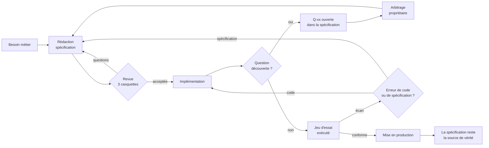

# Cadre de spécification algorithmique métier

*Version 1.0 — document de référence*

---

## Sommaire

- [0. En une page](#0-en-une-page)
- [1. Le principe](#1-le-principe)
  - [1.1 Le problème qu'on cherche à résoudre](#11-le-problème-quon-cherche-à-résoudre)
  - [1.2 Le principe : le métier écrit la loi, l'IT écrit la machine](#12-le-principe--le-métier-écrit-la-loi-lit-écrit-la-machine)
  - [1.3 Le critère d'acceptation : le test de la double implémentation](#13-le-critère-dacceptation--le-test-de-la-double-implémentation)
  - [1.4 La frontière métier / technique](#14-la-frontière-métier--technique)
  - [1.5 Les faux amis](#15-les-faux-amis)
- [2. Le pseudo-langage](#2-le-pseudo-langage)
  - [2.8 Adapter le cadre au calcul scientifique](#28-adapter-le-cadre-au-calcul-scientifique)
- [3. L'anatomie d'une spécification](#3-lanatomie-dune-spécification)
- [4. La fiche de contraintes : ce qui permet de choisir le langage et l'architecture](#4-la-fiche-de-contraintes--ce-qui-permet-de-choisir-le-langage-et-larchitecture)
- [5. Le jeu d'essai : l'oracle](#5-le-jeu-dessai--loracle)
- [6. Le processus et la gouvernance](#6-le-processus-et-la-gouvernance)
- [7. Mise en place progressive](#7-mise-en-place-progressive)
- [8. Anti-patterns](#8-anti-patterns)
- [9. Les exemples : lecture guidée](#9-les-exemples--lecture-guidée)
- [Annexe A — Aide-mémoire du pseudo-langage](#annexe-a--aide-mémoire-du-pseudo-langage)

---

## 0. En une page

**Ce qui change.** L'expert métier ne livre plus un classeur Excel, un notebook ou un
script. Il livre une **spécification algorithmique** : un document versionné, en
markdown, dans le dépôt Git, écrit dans un pseudo-langage contraint.

**Ce que la spécification contient obligatoirement.**

1. Le **vocabulaire** du domaine (glossaire), utilisé partout de la même façon.
2. Les **entrées et sorties typées**, avec unité, devise, fuseau, précision, domaine
   de validité.
3. Les **règles** numérotées (`RG-010`, `RG-020`…), chacune écrite en pseudo-langage,
   chacune traçable jusqu'au code et jusqu'aux tests.
4. Les **paramètres** (seuils, taux, barèmes) séparés des règles, avec leur
   propriétaire, leur circuit de mise à jour et leur date d'effet.
5. Les **invariants** — ce qui doit rester vrai quoi qu'il arrive.
6. Le **jeu d'essai** : les cas nominaux, les cas aux limites, les cas d'erreur, avec
   les résultats attendus calculés à la main.
7. La **fiche de contraintes** : volumes, latence, précision, rejouabilité,
   auditabilité, disponibilité, fréquence de changement — chiffrés, en unités métier.
8. Les **questions ouvertes**, nommées, avec un décideur et une échéance.

**Ce que la spécification ne contient jamais.** Un nom de langage, de base de données,
de bibliothèque, de serveur. Une structure de données technique. Une optimisation. Un
« il faudra que ce soit rapide ». Un `try / except`.

**Le contrat.** Le métier est souverain sur *ce qui est calculé*. L'IT est souveraine
sur *comment c'est calculé*. Quand un développeur découvre un cas non prévu, il
n'invente pas : il ouvre une **question** dans la spécification, et le métier tranche.

---

## 1. Le principe

### 1.1 Le problème qu'on cherche à résoudre

Dans beaucoup d'organisations, la connaissance algorithmique est détenue par des gens
dont le métier n'est pas de développer : actuaires, analystes de risque, ingénieurs
process, tarificateurs, chargés de conformité, chercheurs, contrôleurs de gestion. Ces
personnes codent quand même — parce que c'est le seul moyen qu'elles ont de vérifier
que leur idée tient. Et ce code finit invariablement dans l'un de ces trois états :

| État | Ce qui se passe | Le coût |
|---|---|---|
| **Le prototype devient la production** | Le classeur ou le script tourne « en attendant », puis pendant huit ans. | Personne n'ose y toucher, personne ne sait le tester, une seule personne le comprend. |
| **Le prototype est réécrit** | L'IT le réimplémente « proprement ». | La règle dérive silencieusement. Les écarts se découvrent en production, souvent via un client ou un auditeur. |
| **Le prototype est jeté** | Le développeur repart d'une spécification en prose de trois pages. | Les 40 décisions implicites du prototype (arrondis, ordres, valeurs par défaut, départages) sont reprises au hasard. |

Le point commun des trois : **le code du métier mélange indissociablement l'intention
et la mise en œuvre**. On ne sait plus distinguer « on retient le prix le plus bas »
(une règle de gestion, votée, opposable) de « on trie la liste puis on prend le
premier » (un choix d'implémentation, remplaçable).

Le second effet est plus grave : quand la spécification est floue, **c'est le
développeur qui décide du métier**, sans le savoir et sans mandat. Il choisit un
arrondi, une valeur par défaut sur une donnée absente, un ordre d'application de deux
remises. Ces décisions ont des conséquences comptables, contractuelles et parfois
réglementaires — prises par la mauvaise personne, au mauvais moment, sans trace.

### 1.2 Le principe : le métier écrit la loi, l'IT écrit la machine

> L'expert métier produit un **texte normatif** décrivant *ce qui doit être calculé*.
> Le développeur produit un **programme** décidant *comment le calculer*.

Ce n'est pas une répartition de tâches, c'est une répartition de **souveraineté** :

- Le métier n'a pas à justifier ses règles auprès de l'IT — il les pose, il en répond.
- L'IT n'a pas à justifier ses choix techniques auprès du métier — elle les fait, elle
  en répond (coût, délai, exploitabilité).
- **Aucun des deux ne se prononce dans le champ de l'autre.** Une spécification qui dit
  « stocker dans une table indexée sur la référence produit » est aussi fautive qu'un
  développeur qui décide seul d'arrondir au centime inférieur.

L'objectif de forme qui découle du principe : **la spécification doit contraindre le
résultat et libérer le chemin.** Chaque fois qu'on peut décrire un résultat plutôt
qu'un parcours, on le fait — c'est ce qui laisse au développeur la latitude de
vectoriser, paralléliser, déporter dans une base, mettre en cache, sans jamais trahir
la règle.

### 1.3 Le critère d'acceptation : le test de la double implémentation

Une spécification est finie quand :

> **Deux développeurs qui ne se parlent pas, dans deux langages différents, produisent
> des programmes qui donnent le même résultat sur tout le jeu d'essai — et sur les cas
> auxquels personne n'avait pensé.**

C'est un critère opérationnel, pas une figure de style. Il se pratique :

- **En vrai, une fois**, sur la première spécification écrite dans l'organisation : deux
  personnes implémentent, on compare. Les écarts constatés sont la liste exacte de ce
  qui manque au cadre. C'est l'exercice d'étalonnage le plus rentable de la démarche.
- **Par la pensée, à chaque relecture** : le relecteur cherche activement un endroit où
  il pourrait, de bonne foi, coder autre chose que ce que l'auteur avait en tête.

Corollaire utile : *si une variation d'implémentation change le résultat, il manque une
règle. Si elle ne change que le temps ou la mémoire, tout va bien.*

### 1.4 La frontière métier / technique

La règle de partage tient en une phrase :

> **Si modifier ce point change un résultat observable par un client, un comptable, un
> régulateur ou un opérateur → c'est du métier.
> Si ça ne change que le temps, la mémoire, le coût, ou la façon de déployer → c'est de
> la technique.**

| Relève du métier (dans la spécification) | Relève de la technique (hors spécification) |
|---|---|
| Ce qui est calculé, et à partir de quoi | Le langage, le framework, la bibliothèque |
| L'ordre des opérations quand il change le résultat | L'ordre des opérations quand il ne le change pas |
| Les arrondis, la précision, les unités, les devises | Le type numérique concret retenu |
| Le comportement en cas de donnée absente ou invalide | Le mécanisme de validation, la gestion des exceptions |
| Le départage des ex æquo | L'algorithme de tri utilisé |
| Les seuils, plafonds, planchers, barèmes | Le stockage des paramètres |
| La date d'effet d'une règle | Le mécanisme de versionnement |
| Le mode dégradé attendu quand une dépendance tombe | Le mécanisme de reprise, les tentatives, les délais |
| Les volumes, la latence acceptable, la rejouabilité | L'architecture qui les satisfait |
| Ce qui doit être justifiable et conservé | Le format et le support de la trace |

### 1.5 Les faux amis

Ce sont les points qui *ressemblent* à de la technique et qui sont du métier. Ils sont
la cause majoritaire des écarts entre la spécification et le programme. Une
spécification doit les traiter explicitement, toujours :

1. **L'arrondi.** À quelle étape ? À combien de décimales ? Dans quel sens
   (commercial, inférieur, supérieur, au pair) ? Et surtout : *que fait-on du centime
   résiduel* quand la somme des lignes arrondies ne retombe pas sur le total arrondi ?
2. **L'ordre des opérations non commutatives.** Deux remises de 10 % et de 5 € ne
   donnent pas le même résultat selon l'ordre. Le métier tranche, et écrit pourquoi.
3. **Le départage des ex æquo.** « On retient l'offre la moins chère » — et s'il y en a
   deux ? Sans règle de départage, le résultat dépend de l'ordre de lecture des données,
   donc de l'implémentation, donc il n'est pas reproductible.
4. **Les valeurs absentes.** Une donnée manquante : on rejette, on prend une valeur par
   défaut, on ignore la ligne, on dégrade ? Chacune de ces réponses est une décision
   métier différente, aux conséquences différentes.
5. **Le temps.** Quel fuseau ? Quel calendrier de jours ouvrés ? Quelle heure de
   bascule ? Quelle date fait foi : la date de l'événement, celle de sa saisie, ou
   celle du calcul ? Et lors d'un rejeu, on utilise les règles d'aujourd'hui ou celles
   en vigueur à la date de l'événement ?
6. **Les unités et devises.** Et le taux de conversion : quel taux, à quelle date, de
   quelle source, arrondi comment ?
7. **Les bornes.** Un seuil est-il atteint à `≥` ou à `>` ? Un plafond écrête-t-il ou
   rejette-t-il ? Une boucle a-t-elle un nombre maximal d'itérations, et que se
   passe-t-il si on l'atteint ?
8. **Le comportement en cas d'erreur.** « Le service de fidélité est indisponible » :
   on refuse la commande, ou on la passe sans fidélité en prévenant le client ? C'est
   une décision commerciale, pas une décision d'exploitation.

Et symétriquement, les points qui *ressemblent* à du métier et qui n'en sont pas : le
cache, le traitement par lots ou au fil de l'eau, le nombre de tentatives, l'index, la
montée en charge, le choix entre un moteur de règles et du code. Le métier fournit les
**contraintes** (§4) ; il ne choisit pas la solution.

---

## 2. Le pseudo-langage

### 2.1 Ce qu'on cherche

Un pseudo-langage n'est pas un langage de programmation simplifié : c'est du **français
discipliné**. Il doit être lisible par un juriste, un auditeur ou un nouveau venu dans
l'équipe, et exécutable mentalement sans ambiguïté par un développeur.

Trois qualités à tenir, dans cet ordre :

1. **Non ambigu** — une seule lecture possible.
2. **Lisible par un non-informaticien** — c'est ce qui permet la relecture par les pairs
   métier, qui est le vrai contrôle qualité de la démarche.
3. **Neutre technologiquement** — rien qui présuppose un langage ou une structure.

> On résiste à la tentation d'un langage formel complet (B, Alloy, TLA+, Z). Ces
> langages sont supérieurs sur le point 1 et disqualifiés sur le point 2 : une
> spécification que le métier ne peut pas relire est une spécification que le métier
> n'écrit pas.

### 2.2 Structures autorisées

```
DÉFINIR <nom_de_la_fonction>(<paramètre> : <type>, ...) : <type de retour>

ENTRÉES        — la liste typée de ce qui entre
SORTIES        — la liste typée de ce qui sort
PRÉCONDITIONS  — ce qui est supposé vrai en entrée (sinon → erreur)
POSTCONDITIONS — ce qui est garanti vrai en sortie
INVARIANTS     — ce qui est vrai à tout instant

SOIT <nom> = <expression>                    (nommer un résultat intermédiaire)

SI <condition> ALORS
    ...
SINON SI <condition> ALORS
    ...
SINON
    ...
FIN SI

POUR CHAQUE <élément> DANS <collection>      (parcours sans indice)
    ...
FIN POUR

RETOURNER <expression>
SIGNALER ERREUR <CODE-ERREUR> « message destiné au métier »
```

Opérations ensemblistes, à privilégier systématiquement :

```
FILTRER <collection> OÙ <condition>
REGROUPER <collection> PAR <critère>
TRIER <collection> PAR <critère> CROISSANT|DÉCROISSANT, PUIS PAR <critère> ...
SOMME / MOYENNE / MINIMUM / MAXIMUM / NOMBRE DE ... DANS <collection>
LE PREMIER / LE DERNIER <élément> DE <collection triée>
ARRONDIR(<valeur>, <décimales>, <mode>)
```

### 2.3 Types, unités, domaines

**Toute grandeur porte son unité. Toujours.** C'est la règle qui rapporte le plus pour
ce qu'elle coûte.

```
montant_ht        : Montant(EUR, 2 décimales)
poids             : Poids(kg, 3 décimales, ≥ 0)
taux_remise       : Taux(0,0000 .. 1,0000, 4 décimales)
date_commande     : Horodatage(fuseau Europe/Paris)
date_effet        : Date(calendrier grégorien)
quantité          : Entier(≥ 1)
référence_produit : Identifiant(texte, 3 à 20 caractères, unique)
zone_livraison    : Énuméré { FRANCE_METRO, UE, HORS_UE }
```

On ne se sert **jamais** de types techniques (`int32`, `float`, `varchar(50)`,
`timestamp`) : ce sont des décisions du développeur, et elles découlent du domaine
qu'on vient de décrire — pas l'inverse.

Pour les montants, on précise en plus, une fois pour toutes, dans la spécification :
la devise, le nombre de décimales, le mode d'arrondi par défaut, et l'étape à laquelle
l'arrondi intervient.

### 2.4 Décrire un résultat, pas un parcours

C'est la règle de style la plus importante, parce que c'est elle qui **libère
l'architecture**.

| ✗ On impose un parcours | ✓ On décrit un résultat |
|---|---|
| `POUR i DE 1 À n : total = total + ligne[i].montant` | `SOIT total = SOMME DES montant DES lignes` |
| « on parcourt les offres et on garde la meilleure » | « l'offre retenue est celle de prix minimal ; en cas d'égalité, celle de référence alphabétiquement la plus petite » |
| « on boucle tant qu'il reste du budget » | « on retient le plus grand sous-ensemble de commandes dont la somme n'excède pas le budget, par ordre de priorité décroissante » |

Formulé en résultat, le développeur peut choisir une somme en mémoire, une agrégation
SQL, un calcul distribué ou un cache incrémental : **aucun de ces choix ne peut trahir
la règle**. Formulé en parcours, il croit devoir reproduire la boucle, et la première
optimisation devient un risque de régression métier.

Corollaire : une boucle explicite dans une spécification doit être **justifiée** — en
général parce que l'itération est réellement séquentielle (calcul récursif, application
successive d'un barème par tranches, convergence itérative). Dans ce cas, on précise le
critère d'arrêt **et** le nombre maximal d'itérations **et** ce qui se passe si on
l'atteint.

### 2.5 Les tables de décision

Dès qu'une règle combine plus de deux conditions, on abandonne les `SI` imbriqués pour
une table. Une table de décision a une propriété que le texte n'a pas : **on voit tout
de suite s'il manque une ligne**.

| Code promo | Remise quantité déjà appliquée | Client adhérent | Remise panier appliquée |
|---|---|---|---|
| absent | — | — | aucune |
| non cumulable | oui | — | aucune (`RG-032`) |
| non cumulable | non | — | selon barème |
| cumulable | — | — | selon barème |
| expiré | — | — | erreur `E-PROMO-002` |

Règle de complétude : **toute combinaison possible des colonnes d'entrée apparaît dans
exactement une ligne**, `—` signifiant « quelle que soit la valeur ». Si une
combinaison n'apparaît nulle part, la spécification est incomplète ; si elle apparaît
deux fois, elle est contradictoire. Cette vérification est mécanique — elle peut se
faire en revue en trente secondes, et c'est le meilleur détecteur de trou connu.

### 2.6 Ce qu'on n'écrit pas

- Aucun nom de langage, de bibliothèque, de base de données, de service technique.
- Aucun type technique, aucune structure de données (« tableau », « dictionnaire »,
  « table de hachage »).
- Aucune considération de performance (« il faut que ce soit rapide », « éviter les
  boucles imbriquées ») — elles vont dans la fiche de contraintes (§4), chiffrées.
- Aucune gestion technique d'erreur : pas de tentatives, de délais d'attente, de
  transactions, de journalisation. La spécification dit *quelle erreur métier est
  signalée et ce qui se passe alors*, pas comment on la propage.
- Aucune entrée/sortie : ni lecture de fichier, ni appel réseau, ni affichage. Une
  spécification décrit une **fonction** : mêmes entrées → mêmes sorties.
- Aucun état global mutable.
- Aucun « etc. », « et ainsi de suite », « on gère les cas particuliers », « comme
  d'habitude », « le bon sens ». Ce sont les quatre mots qui coûtent le plus cher.

### 2.7 Identifiants et traçabilité

Chaque règle porte un identifiant **stable et jamais réutilisé** :

- `RG-xxx` — règle de gestion
- `P-xx` — paramètre
- `E-xxx` — cas d'erreur métier
- `INV-xx` — invariant
- `CT-xx` — cas de test
- `Q-xx` — question ouverte

Ces identifiants sont le fil qui relie tout :

```
RG-080 (spécification)
   ├── cité en commentaire dans le code qui l'implémente
   ├── cité dans le nom ou la description des tests automatisés
   └── couvert par CT-04 et CT-07 du jeu d'essai
```

Ce qu'on gagne : quand la règle change, on trouve le code en une recherche ; quand un
test casse, on sait quelle décision métier est en cause ; quand un auditeur demande
« où est implémentée cette règle », la réponse prend dix secondes.

Un identifiant n'est **jamais recyclé**. Une règle supprimée reste dans le document,
barrée, avec sa date de fin d'effet — parce qu'un calcul rejoué sur une période
antérieure doit pouvoir s'y référer.

### 2.8 Adapter le cadre au calcul scientifique

Le cadre s'applique tel quel à un algorithme scientifique, mais trois points demandent
une adaptation explicite. Ils sont illustrés dans
[exemples/SPEC-THM-001-refroidissement.md](exemples/SPEC-THM-001-refroidissement.md).

**1. Spécifier le modèle et la tolérance, pas la méthode de résolution.**
« Intégrer par Runge-Kutta d'ordre 4 avec un pas de 1 s » est un choix d'implémentation
déguisé en règle : il interdit la solution exacte quand elle existe, et devient faux dès
que les conditions changent. Ce que l'expert doit écrire, c'est **l'équation, ses
hypothèses, et la tolérance** — puis laisser le développeur choisir. Même chose pour un
filtre ou une régularisation : au lieu de nommer la méthode, on énonce le **contrat**
qu'elle doit honorer (« réduire le bruit d'un facteur 2 sans déplacer le sommet d'un pic
de plus d'un demi-pas ») et le **protocole qui le vérifie**. C'est la contrepartie de la
liberté : on ouvre le choix sans ouvrir le risque.

**2. Dédoubler — voire tripler — le critère d'acceptation.**
Le test de la double implémentation (§1.3) suppose une égalité exacte, qui n'a pas de
sens sur des grandeurs continues. Il faut le scinder :

| | **Reproductibilité** | **Justesse numérique** | **Validité du modèle** |
|---|---|---|---|
| Question | Deux implémentations conformes donnent-elles le même nombre ? | Le nombre est-il la vraie solution des équations ? | Les équations décrivent-elles la réalité ? |
| S'évalue contre | La définition de la spécification | Une solution analytique ou un cas de synthèse | Des mesures réelles |
| Ordre de grandeur | 10⁻⁹ relatif, égalité stricte sur les décomptes et les indicateurs | 10⁻⁶ à quelques pour mille | quelques pour cent, selon le domaine |
| Un dépassement signifie | Une implémentation n'est pas conforme, **ou la spécification est ambiguë** | La méthode ou son pas est inadapté | Les hypothèses sont sorties de leur domaine — **pas un défaut du programme** |
| Se contrôle | En recette, à chaque livraison | En recette, sur les cas de synthèse | En validation de modèle, avec le métier |

Confondre ces niveaux est l'erreur la plus commune sur un logiciel scientifique : un
écart de 2 % à la mesure peut être parfaitement normal, un écart de 10⁻⁶ entre deux
implémentations ne l'est jamais. **C'est aussi ce qui protège l'équipe de
développement** : sans cette distinction, chaque écart de mesure devient un ticket de
bogue, et l'équipe cherche un défaut dans du code correct.

**3. Définir les conventions numériques que le continu masque.**
Trois faux amis s'ajoutent à ceux du §1.5, et ils sont propres au calcul scientifique :

- **L'interpolation.** « L'aire sous la courbe » n'a aucun sens pour un signal
  échantillonné tant qu'on n'a pas dit ce que vaut le signal *entre* deux points.
  Déclarer l'interpolation (affine, spline, autre) rend la grandeur exactement
  calculable ; l'omettre, c'est autoriser trapèzes, Simpson et splines à cohabiter —
  trois résultats différents, tous « corrects ».
- **La convergence.** Tout calcul itératif exige trois éléments dans la spécification :
  le critère d'arrêt, le nombre maximal d'itérations, et **ce qui est rapporté en cas de
  non-convergence** (une erreur ? le dernier itéré, marqué ?). Le premier est toujours
  écrit, le deuxième souvent, **le troisième presque jamais** — et c'est celui-là qui
  produit les résultats faux silencieux, quand le programme renvoie son dernier itéré
  comme s'il avait convergé.
- **Les asymptotes et les domaines de validité.** Une grandeur qui tend vers une limite
  sans l'atteindre rend certaines questions mathématiquement solubles et physiquement
  absurdes. Le métier doit poser la marge qui transforme l'asymptote en décision.
- **L'aléatoire.** Dès qu'une étape est stochastique — rééchantillonnage, Monte-Carlo,
  initialisation aléatoire —, **l'algorithme du générateur et sa graine deviennent des
  entrées de la spécification**, au même titre que les données. Ce n'est pas un détail
  technique : la reproductibilité d'un résultat publié en dépend.

Enfin, une propriété de forme spécifique au scientifique : les **invariants de symétrie**
(§5) y sont particulièrement rentables — invariance par translation de l'origine des
temps, homogénéité vis-à-vis d'un changement d'unité, invariance par permutation des
entrées. Ils ne coûtent rien à écrire, se testent sur des milliers d'entrées générées, et
attrapent la classe d'erreurs la plus pernicieuse : celle où le résultat dépend
silencieusement des unités ou de l'origine choisies.

---

## 3. L'anatomie d'une spécification

Le squelette à copier est dans [templates/MODELE-SPECIFICATION.md](templates/MODELE-SPECIFICATION.md).
Voici le rôle de chaque section — et pourquoi aucune n'est facultative.

| # | Section | À quoi elle sert | Ce qui arrive si on la saute |
|---|---|---|---|
| 1 | **En-tête** — identifiant, version, statut, auteur, propriétaire métier, date d'effet | Savoir qui répond de quoi, et à partir de quand la règle s'applique | On ne sait pas quelle version a produit le chiffre de l'an dernier |
| 2 | **Objectif et contexte** — en cinq lignes, ce que ça calcule et pour qui | Permettre à un lecteur de décider en 30 secondes si ça le concerne | Personne ne lit |
| 3 | **Périmètre / hors périmètre** — explicitement les deux | Fixer la frontière du contrat | Le développeur découvre en fin de course que « bien sûr, il fallait aussi gérer les avoirs » |
| 4 | **Glossaire** — chaque terme du domaine, défini une fois | Donner un vocabulaire unique au métier, au code et aux tests | Trois mots pour la même chose, un mot pour trois choses |
| 5 | **Entrées / Sorties** — typées, avec unités et domaines | Poser le contrat de la fonction | Ambiguïtés d'unité, de devise, de fuseau |
| 6 | **Paramètres** — les valeurs, séparées des règles, avec propriétaire et date d'effet | Distinguer ce qui change souvent de ce qui change rarement | Un changement de taux devient une livraison logicielle |
| 7 | **Règles** — numérotées, en pseudo-langage | Le cœur | — |
| 8 | **Invariants et propriétés** | Ce qui doit rester vrai quelles que soient les entrées | On ne détecte pas les régressions sur les cas non testés |
| 9 | **Cas d'erreur métier** — code, condition, message, conséquence | Décider du comportement anormal *par le métier* | Le développeur invente le comportement de rejet |
| 10 | **Jeu d'essai** — cas nominaux, limites, erreurs, avec résultats calculés | Rendre la spécification vérifiable (§5) | La recette se fait « à l'œil », par comparaison avec l'ancien système |
| 11 | **Fiche de contraintes** — volumes, latence, précision, rejouabilité… (§4) | Permettre le choix du langage et de l'architecture | L'IT devine, et se trompe d'un facteur 100 |
| 12 | **Questions ouvertes** — `Q-xx`, décideur, échéance | Rendre l'incertitude visible au lieu de la laisser se résoudre en silence | Le développeur tranche à la place du métier |
| 13 | **Historique** — versions, ce qui a changé, impact sur les résultats | Traçabilité réglementaire et comptable | Impossible d'expliquer un écart entre deux exercices |

Sur la section 6, une précision qui a des conséquences architecturales lourdes :

> **Un paramètre n'est pas une règle.** Une règle dit « on applique une remise de
> quantité au-delà d'un certain seuil ». Un paramètre dit « ce seuil vaut 3 unités
> depuis le 1er janvier ». Les deux ne changent ni à la même fréquence, ni par les
> mêmes personnes, ni selon le même circuit d'approbation. Les mélanger, c'est
> transformer chaque décision commerciale en projet informatique.

Chaque paramètre est décrit par : identifiant, libellé, valeur, unité, **propriétaire**
(la personne ou le rôle qui peut le changer), **circuit de modification** (qui valide),
**fréquence de changement observée**, **date d'effet**. Ces trois derniers points sont
lus directement par l'architecte (§4).

---

## 4. La fiche de contraintes : ce qui permet de choisir le langage et l'architecture

C'est la partie que les experts métier oublient toujours, et c'est celle sans laquelle
le développeur ne peut rien décider. **Le métier n'y exprime pas des solutions : il y
exprime des contraintes, en unités métier, chiffrées.** L'IT en déduit la solution.

| Dimension | Ce que le métier écrit | Ce que l'IT en déduit |
|---|---|---|
| **Volumétrie** | Nombre d'exécutions par jour, taille typique et maximale d'une entrée, croissance attendue à 3 ans | Dimensionnement, traitement unitaire ou massif, coût |
| **Profil de charge** | Charge moyenne et charge de pointe (facteur et durée), saisonnalité | Élasticité, files d'attente, garde-fous |
| **Mode d'appel** | À la demande / par lots à heure fixe / à la survenue d'un événement | Architecture d'intégration : service, tâche planifiée, flux |
| **Latence** | Temps de réponse acceptable, et **ce qui se passe si on le dépasse** | Synchrone ou asynchrone, mise en cache, précalcul |
| **Fraîcheur des données** | À quelle date les données doivent être arrêtées ; délai toléré | Sourcing, réplication, cohérence |
| **Exactitude** | Précision requise, mode d'arrondi, tolérance acceptée sur un écart | **Choix du type numérique** — décimal exact ou flottant — donc contrainte forte sur le langage et les bibliothèques |
| **Déterminisme** | Deux exécutions identiques doivent-elles donner exactement le même résultat ? | Interdiction du parallélisme non ordonné, du hasard, des dépendances à l'horloge |
| **Rejouabilité** | Doit-on pouvoir recalculer un résultat de l'an dernier et retrouver le même chiffre ? Sur quelle profondeur ? | **Versionnement conjoint des règles, des paramètres et des données** ; archivage ; horodatage |
| **Auditabilité** | Faut-il justifier le résultat pas à pas ? À qui ? Pendant combien de temps ? | Trace de calcul, format de restitution, conservation |
| **Explicabilité** | Faut-il pouvoir dire à un client *pourquoi* il obtient ce résultat ? | Sortie enrichie du détail, interdiction des modèles opaques |
| **Criticité et mode dégradé** | Que fait-on si une donnée ou un service dont dépend le calcul est indisponible ? (refus / valeur par défaut / résultat partiel signalé) | Redondance, isolation des dépendances, circuit de secours |
| **Confidentialité** | Le calcul manipule-t-il des données personnelles ou sensibles ? Lesquelles ? | Hébergement, cloisonnement, anonymisation, durée de conservation |
| **Conformité** | Textes ou normes applicables, obligations de conservation | Contraintes de journalisation et d'archivage |
| **Fréquence de changement de la règle** | Combien de fois par an la règle change-t-elle ? Et les paramètres ? | **Code figé vs configuration externalisée vs moteur de règles** |
| **Qui modifie la règle** | Le métier doit-il pouvoir modifier une valeur sans livraison logicielle ? | Interface d'administration, circuit de validation, tests de garde-fou |
| **Durée de vie** | Combien de temps ce calcul est-il censé vivre ? | Arbitrage entre effort d'industrialisation et jetable assumé |

Deux commentaires qui valent le détour :

**Le couple « exactitude / déterminisme » décide souvent du langage.** « Les montants
sont exacts au centime, sans erreur de représentation » élimine le flottant binaire et
oriente vers les langages disposant d'un décimal natif ou d'une bibliothèque décimale
éprouvée. « Le résultat doit être identique quel que soit l'ordre de traitement »
interdit certaines parallélisations. Le métier n'a pas besoin de savoir tout cela : il
a juste besoin d'écrire ses deux phrases.

**Le couple « fréquence de changement / qui modifie » décide de l'architecture.** Un
barème modifié une fois tous les cinq ans par la direction, et un barème modifié chaque
semaine par le marketing, produisent deux architectures radicalement différentes — code
en dur d'un côté, référentiel de paramètres versionné et daté de l'autre. C'est la
question la moins technique de la liste, et c'est celle qui a le plus d'impact
technique.

---

## 5. Le jeu d'essai : l'oracle

Une spécification sans jeu d'essai n'est pas une spécification : c'est une intention.

Le jeu d'essai est écrit **par le métier**, et ses résultats attendus sont **calculés à
la main** (ou avec un tableur, peu importe) — jamais produits par l'implémentation. Un
résultat attendu produit par le programme qu'il est censé valider ne prouve rien : il
mesure la cohérence du programme avec lui-même.

Ce qu'il contient, dans cet ordre :

1. **Un ou deux cas nominaux**, simples, qu'on peut suivre de tête.
2. **Un cas riche**, qui déclenche le plus de règles possible en même temps, avec sa
   **trace de calcul détaillée** — étape par étape, chaque montant intermédiaire écrit.
   C'est le cas qui sert de référence commune quand un doute apparaît, six mois plus
   tard, sur l'ordre d'application des règles.
3. **Les cas aux limites** : zéro, vide, une seule ligne, valeur exactement égale au
   seuil (`≥` ou `>` ?), ex æquo, montant qui tombe pile sur un demi-centime, plafond
   atteint, date de bascule d'un paramètre, franchissement d'un changement d'année.
4. **Les cas d'erreur** : pour chacun, le code d'erreur attendu et ce qui est retourné
   (rien ? un résultat partiel ?).
5. **Une table de couverture** : pour chaque `RG-xxx`, le ou les cas qui l'exercent. Une
   règle non couverte est soit inutile, soit un test manquant — les deux méritent une
   discussion.

Enfin, on écrit les **propriétés** (§ invariants), qui valent pour *toutes* les entrées
et pas seulement pour les cas listés :

```
INV-01  Le montant à payer est toujours supérieur ou égal à zéro.
INV-02  La somme des montants nets des lignes est égale au montant net total.
INV-03  Ajouter un article à un panier ne peut jamais diminuer le montant avant remise.
INV-04  Le calcul est idempotent : recalculer un panier inchangé donne le même montant.
```

Ces propriétés sont un cadeau au développeur : elles se testent automatiquement sur des
milliers d'entrées générées aléatoirement, et elles trouvent les cas auxquels le métier
n'avait pas pensé. C'est le complément naturel du test de la double implémentation.

---

## 6. Le processus et la gouvernance

### 6.1 Les rôles

| Rôle | Qui | Responsabilité |
|---|---|---|
| **Auteur métier** | l'expert du domaine | Écrit la spécification, répond des règles |
| **Propriétaire de la règle** | souvent un responsable métier | Arbitre les questions ouvertes, valide les changements ayant un impact sur les résultats |
| **Relecteur métier** | un pair de l'auteur | Vérifie l'exactitude métier et la complétude des cas |
| **Répondant technique** | un développeur | Vérifie que c'est implémentable, chiffre, signale les contraintes irréalistes ou coûteuses |
| **Relecteur test** | testeur / recette | Vérifie que la spécification est vérifiable : jeu d'essai, couverture, invariants |

Trois relecteurs, trois casquettes. Une spécification relue par une seule population
n'est relue par personne.

### 6.2 Le cycle de vie



Le point non négociable du schéma : **le développeur ne corrige jamais une règle
silencieusement**. Quand il rencontre un cas non prévu — et il en rencontrera —, il
ouvre une question `Q-xx` dans le document, et le propriétaire tranche. Une décision
métier prise dans un commit est une décision perdue.

Le second point : **quand le programme et la spécification divergent, c'est la
spécification qui fait foi** — soit le code est corrigé, soit la spécification est
amendée explicitement, avec une nouvelle version et une trace. Jamais de troisième
voie.

### 6.3 La spécification vit dans Git

Même dépôt que le code, ou dépôt dédié — mais Git, en markdown, pas un traitement de
texte partagé :

- **l'historique** répond à « qui a changé cette règle, quand, et pourquoi » ;
- **la revue par demande de fusion** donne un lieu de discussion attaché à la ligne
  concernée ;
- **la comparaison de versions** montre exactement ce qui a bougé entre deux exercices ;
- **les étiquettes de version** permettent de retrouver la spécification exacte qui a
  produit le chiffre d'une date donnée.

Le frein réel est l'inconfort de Git pour un non-développeur. Il se traite : édition
directe dans l'interface web de la forge, modèle pré-rempli, un accompagnement en
binôme sur les deux premières spécifications. Cet inconfort dure deux semaines ; le
bénéfice dure des années.

### 6.4 Le versionnement, en termes métier

| Incrément | Quand | Conséquence |
|---|---|---|
| **Majeur** (2.0.0) | Un résultat change pour au moins un cas | Nouvelle date d'effet, information des consommateurs, rejeu à prévoir |
| **Mineur** (1.3.0) | Un cas nouveau est couvert, sans changer les résultats existants | Nouveaux tests, pas de rejeu |
| **Correctif** (1.2.4) | Clarification de rédaction, sans aucun impact sur les résultats | Rien |

L'auteur doit pouvoir justifier son incrément. « Ce n'est qu'une clarification » est la
phrase à surveiller en revue : neuf fois sur dix c'est vrai, la dixième fois elle cache
un changement de comportement.

Toute règle porte une **date d'effet** et, si elle est abrogée, une **date de fin
d'effet**. Une règle abrogée n'est pas supprimée du document : elle est barrée et datée,
parce qu'un rejeu sur une période antérieure doit pouvoir s'y référer.

### 6.5 Prêt à développer / prêt à livrer

**Prêt à développer** (la spécification peut partir en développement) :
- [ ] Toutes les entrées et sorties sont typées, avec unité et domaine
- [ ] Chaque règle a un identifiant et est écrite en pseudo-langage
- [ ] Chaque `SI` a son `SINON`, chaque table de décision est complète
- [ ] Les arrondis, les départages et le traitement des valeurs absentes sont explicites
- [ ] Le jeu d'essai existe, avec résultats calculés à la main, et couvre chaque règle
- [ ] La fiche de contraintes est chiffrée
- [ ] Aucune question ouverte bloquante ne subsiste
- [ ] Les trois relecteurs ont approuvé

**Prêt à livrer** (le développement est fini) :
- [ ] Le jeu d'essai passe intégralement, en automatisé
- [ ] Chaque `RG-xxx` est citée dans le code et dans au moins un test
- [ ] Les invariants sont testés sur des entrées générées
- [ ] Les questions apparues pendant le développement ont été arbitrées et reportées
      dans la spécification
- [ ] Les écarts assumés entre la spécification et l'implémentation sont documentés

### 6.6 Mesurer que ça marche

Quatre indicateurs suffisent, et ils se lisent ensemble :

| Indicateur | Ce qu'il révèle |
|---|---|
| Nombre de questions ouvertes par spécification, **et à quel moment elles apparaissent** | Si elles apparaissent en développement plutôt qu'en revue, la revue est trop faible |
| Nombre d'allers-retours entre développement et métier après acceptation | La qualité réelle des spécifications |
| Nombre d'anomalies de **règle** (et non de code) détectées en production | Le résultat final de la démarche |
| Délai entre l'expression du besoin et la mise en production | Le coût de la démarche — il augmente d'abord, puis baisse |

Prévenir la direction du dernier point : **le délai augmente sur les trois premières
spécifications**. On paie d'avance des discussions qui, autrement, auraient eu lieu en
production. C'est le principe même de la démarche, pas un incident de parcours.

---

## 7. Mise en place progressive

Une démarche de ce type échoue quand on l'annonce comme une norme d'entreprise. Elle
réussit quand elle est adoptée parce qu'elle a visiblement marché une fois.

**Étape 1 — L'exercice d'étalonnage (2 à 3 semaines).**
Choisir un algorithme **existant, connu, moyennement complexe et un peu douloureux** —
pas le plus critique, pas le plus trivial. En écrire la spécification *a posteriori*.
Puis l'épreuve de vérité : faire implémenter par un développeur qui ne connaît pas le
domaine, et comparer au système existant. Chaque écart constaté est une case manquante
du cadre. Ce sont ces écarts, et non le discours, qui convainquent.

**Étape 2 — Outiller léger (1 semaine).**
Un dépôt, le modèle, la liste de vérification, la revue en demande de fusion. Rien
d'autre. Surtout pas d'outil dédié, surtout pas de formalisme supplémentaire : chaque
outil ajouté au départ est une raison de ne pas s'y mettre.

**Étape 3 — Former en faisant (2 h + binômes).**
Un atelier de deux heures sur le principe et les faux amis (§1.5), puis les deux
premières spécifications de chaque auteur écrites **en binôme avec un développeur**.
Le binôme est le vrai vecteur d'apprentissage : c'est en voyant le développeur buter
sur une ambiguïté qu'on comprend ce qu'est une ambiguïté.

**Étape 4 — Rendre la spécification obligatoire là où elle est rentable.**
Pas partout. Les critères : la règle a un impact financier, contractuel ou
réglementaire ; elle va vivre plusieurs années ; plusieurs personnes devront la
comprendre ; elle change régulièrement. Une exploration ponctuelle dans un notebook
n'a pas besoin de spécification — et prétendre le contraire discrédite la démarche.

**Étape 5 — Mesurer et raconter.**
Les indicateurs du §6.6, et surtout : rendre publics les cas où la spécification a
évité une erreur. C'est ce qui fait tenir la démarche quand la pression sur les délais
revient.

**Deux pièges d'adoption :**

- *Le formalisme rampant.* Chaque relecteur veut ajouter une section. Au bout de six
  mois, le modèle fait quinze pages et plus personne n'écrit. Le modèle est un bien
  commun : on n'y ajoute une section que si son absence a causé un incident réel.
- *La spécification écrite après le code.* Le jour où quelqu'un code d'abord et
  documente ensuite « pour être conforme au processus », la démarche est morte : il ne
  reste que le coût. C'est le seul point sur lequel il faut être intransigeant.

---

## 8. Anti-patterns

| Anti-pattern | À quoi on le reconnaît | Pourquoi c'est grave |
|---|---|---|
| **Le pseudo-code déguisé** | `import`, `try/except`, `for i in range`, des types techniques | L'auteur pense encore dans son langage ; il transmet ses choix d'implémentation comme s'ils étaient des règles |
| **Le « etc. »** | « les autres cas se traitent de la même façon », « on gère les cas particuliers » | Le développeur devra deviner — et il devinera |
| **La valeur magique** | `0,85` sans nom, sans source, sans propriétaire | Personne ne saura jamais s'il faut la changer, ni qui a le droit de le faire |
| **Le `SI` sans `SINON`** | Une condition sans branche complémentaire | Le comportement dans le cas non traité est décidé par le compilateur |
| **La grandeur nue** | Un montant sans devise, une date sans fuseau, un poids sans unité | Cause classique d'écarts, découverts tard et cher |
| **La performance en prose** | « il faut que ce soit rapide », « éviter les traitements lourds » | Non vérifiable, non actionnable → à remplacer par un chiffre dans la fiche de contraintes |
| **La spécification qui impose la technique** | « stocker dans une table », « utiliser un cache » | Le métier sort de son mandat et empêche des solutions meilleures |
| **L'oracle circulaire** | Les résultats attendus du jeu d'essai ont été produits par le programme | Le test ne vérifie plus rien |
| **La spécification rétroactive** | Écrite après le code, pour la forme | On paie le coût de la démarche sans en avoir le bénéfice |
| **Le paramètre enfermé dans la règle** | Un seuil écrit en toutes lettres au milieu du pseudo-code | Chaque décision commerciale devient une livraison logicielle |
| **La question refermée en silence** | Un `Q-xx` qui disparaît du document sans décision tracée | Quelqu'un a tranché sans mandat, et on ne saura pas qui |

---

## 9. Les exemples : lecture guidée

Le **fil rouge** de ce dépôt — *[l'autonomie d'un véhicule
électrique](exemples/fil-rouge/)* — déroule la méthode complète, du découpage à la
spécification détaillée, en passant par le glossaire du domaine. C'est là qu'il faut
aller pour voir l'ensemble s'articuler.

Deux **vignettes** complètent l'illustration, plus courtes et volontairement issues de
domaines opposés. Elles sont volontairement issues de
domaines opposés, parce que **la même méthode y conduit à des conclusions techniques
contraires** — ce qui est la meilleure preuve que c'est bien la spécification qui décide,
et non l'habitude du développeur.

| | [SPEC-PRX-001](exemples/SPEC-PRX-001-montant-a-payer.md) — gestion | [SPEC-THM-001](exemples/SPEC-THM-001-refroidissement.md) — scientifique |
|---|---|---|
| Le calcul | Le montant à payer d'une commande | La température d'une boisson qui refroidit |
| Grandeurs | Montants, taux, quantités | Températures, durées, masses |
| Exigence d'exactitude | **Exacte au centime** | **Tolérance relative** |
| Type numérique qui en découle | **Décimal exact obligatoire** | **Double précision binaire suffisante** |
| Critère d'acceptation | Égalité stricte | Reproductibilité 10⁻⁹, justesse 10⁻⁶, validité ± 2 °C (§2.8) |
| L'ordre des opérations | Remise ligne, puis panier, puis fidélité | Ajouter le lait tôt ou tard — deux tiers de degré d'écart |
| Le piège central traité | Le centime résiduel d'une répartition au prorata | La non-convergence, et l'asymptote qu'on ne peut pas atteindre |
| Ce que la liberté laissée permet | Jointure, calcul en mémoire ou cache | Forme fermée **ou** intégrateur numérique — les deux conformes |

### Ce qu'il faut regarder dans l'exemple de gestion

**Les paramètres séparés des règles (§6).** Le seuil de franchise de port a un
propriétaire (« Direction commerciale »), une fréquence de changement observée
(« hebdomadaire en soldes ») et une date d'effet. L'architecte y lit immédiatement :
*ces valeurs ne doivent pas être dans le code*.

**Une règle qui ne dit pas comment (`RG-010`).**

```
RG-010  Prix unitaire retenu
   Pour chaque ligne, le prix unitaire retenu est le plus petit
   du prix catalogue et du prix promotionnel en vigueur à la date de commande.
   S'il n'existe aucun prix promotionnel en vigueur, le prix catalogue est retenu.
```

Aucune boucle, aucun tri, aucune structure : le développeur peut résoudre cela par une
jointure en base, un calcul en mémoire ou un cache. Aucun de ces choix ne peut trahir la
règle.

**Un faux ami traité (`RG-085`, le centime résiduel).** Une remise de 5,00 € répartie au
prorata sur trois lignes donne 5,01 € après arrondi. Un développeur laissé seul face à ce
centime prendra une décision — au hasard, et différente d'un développeur à l'autre. La
spécification tranche : *l'écart est imputé à la ligne dont le montant net est le plus
élevé, et en cas d'égalité à celle dont la référence produit est alphabétiquement la plus
petite*. C'est le genre de phrase qui distingue une spécification d'une intention.

**Un mode dégradé qui est une décision commerciale.** « Si le service de fidélité est
indisponible, la commande est calculée sans imputation des points et le client en est
informé ; les points ne sont pas débités. » Ce n'est pas une décision d'exploitation :
c'est un arbitrage entre perdre une vente et mécontenter un client.

### Ce qu'il faut regarder dans l'exemple scientifique

Le phénomène — **une boisson chaude qui refroidit** — est connu de tout le monde et se
calcule avec une loi croisée au lycée. C'est exactement ce qu'on cherche pour un étalon :
aucune connaissance de domaine ne peut y masquer une ambiguïté de rédaction.

**`RG-010` — le modèle, pas la méthode.** La spécification énonce l'équation
différentielle et ses quatre hypothèses assumées. Elle **n'impose ni la solution exacte,
ni un intégrateur numérique** : les deux sont conformes dès lors qu'elles respectent les
tolérances. Écrire « intégrer par Runge-Kutta d'ordre 4 au pas de 1 s » serait une faute
— cela interdirait la forme fermée et deviendrait faux le jour où la température ambiante
varierait.

**`RG-040` — l'ordre des opérations, et il est contre-intuitif.** Ajouter le lait tout de
suite puis attendre un quart d'heure donne **55,18 °C** ; attendre puis ajouter le lait
donne **54,52 °C**. Mêmes ingrédients, même durée, deux tiers de degré d'écart — parce
qu'une boisson déjà refroidie par le lait perd ensuite sa chaleur plus lentement. Aucun
développeur ne peut deviner cela, et aucun ne doit avoir à en décider. C'est le pendant
exact de l'ordre d'application des remises dans l'exemple de gestion.

**`RG-050` — refuser de répondre, de trois façons différentes.** La cible peut être déjà
atteinte, inatteignable (sous la température ambiante), ou atteinte au-delà de l'horizon.
Trois indicateurs distincts, parce qu'une valeur absente seule confondrait trois
situations physiquement différentes — et trois messages différents pour l'utilisateur.

**`RG-060` — la non-convergence est une décision métier.** Le métier tranche : on ne
renvoie rien, on signale. La tentation du développeur — renvoyer le dernier itéré — est
précisément ce qui fabrique les résultats faux silencieux.

**`CT-06` — trois nombres qui valident une symétrie.** Les mêmes données exprimées en
kelvins doivent donner exactement le même instant. Ce cas détecte l'erreur classique
consistant à oublier la température ambiante dans l'exponentielle : plausible en Celsius,
absurde en Kelvin.

**§11 — une spécification, deux fiches de contraintes, deux implémentations.** L'usage
embarqué (moins d'1 ms, hors ligne, sur batterie) et l'usage laboratoire (température
ambiante variable) mènent le même document à **la forme fermée d'un côté et un
intégrateur adaptatif de l'autre** — validés par le même jeu d'essai. C'est la
démonstration la plus nette du cadre : la frontière a été tracée au bon endroit, puisque
deux solutions opposées sont l'une et l'autre conformes.

### Dans les deux cas

Chaque exemple se termine par une **lecture technique** : ce que l'architecte a *déduit*
de la fiche de contraintes. Cette section n'est pas écrite par le métier — elle est la
**réponse** de l'IT, et elle prouve que la spécification contenait bien tout ce qu'il
fallait.

> Si vous ne deviez retenir qu'une chose des deux exemples : ce n'est pas leur longueur,
> c'est que **chaque phrase y répond à une question qu'un développeur se serait posée en
> silence**.

---

## Annexe A — Aide-mémoire du pseudo-langage

À imprimer et à garder à côté du clavier.

```
STRUCTURE
  DÉFINIR nom(param : Type, ...) : Type
  ENTRÉES / SORTIES / PRÉCONDITIONS / POSTCONDITIONS / INVARIANTS
  SOIT x = ...
  SI ... ALORS ... SINON SI ... ALORS ... SINON ... FIN SI
  POUR CHAQUE x DANS collection ... FIN POUR
  RETOURNER x
  SIGNALER ERREUR E-XXX « message »

ENSEMBLES (à préférer aux boucles)
  FILTRER c OÙ cond          REGROUPER c PAR critère
  TRIER c PAR a CROISSANT, PUIS PAR b CROISSANT
  SOMME / MOYENNE / MINIMUM / MAXIMUM / NOMBRE DE ... DANS c
  ARRONDIR(x, 2, COMMERCIAL | INFÉRIEUR | SUPÉRIEUR | AU_PAIR)

TYPES (toujours avec unité et domaine)
  Montant(EUR, 2 décimales)      Taux(0..1, 4 décimales)
  Poids(kg, 3 décimales, ≥ 0)    Entier(≥ 1)
  Horodatage(fuseau …)           Date(…)
  Énuméré { A, B, C }            Identifiant(texte, n..m caractères)

IDENTIFIANTS
  RG-xxx règle   P-xx paramètre   E-xxx erreur
  INV-xx invariant   CT-xx cas de test   Q-xx question ouverte

LES 8 QUESTIONS À SE POSER AVANT DE DIRE « C'EST FINI »
  1. Chaque grandeur a-t-elle son unité, sa devise, son fuseau ?
  2. Chaque SI a-t-il son SINON ? Chaque table est-elle complète ?
  3. Où arrondit-on, à combien, dans quel sens, et où va le résidu ?
  4. Que fait-on des ex æquo ?
  5. Que fait-on d'une donnée absente, nulle, négative, aberrante ?
  6. L'ordre d'application des règles change-t-il le résultat ? Si oui, est-il écrit ?
  7. Chaque règle est-elle couverte par au moins un cas de test calculé à la main ?
  8. Les volumes, la latence, la précision et la rejouabilité sont-ils chiffrés ?
```

---

*Ce cadre est un outil, pas un règlement. Une section qui ne sert jamais doit être
supprimée ; une question qui revient toujours doit être ajoutée à la liste de
vérification. La seule règle non négociable est la première : la spécification s'écrit
avant le code.*
