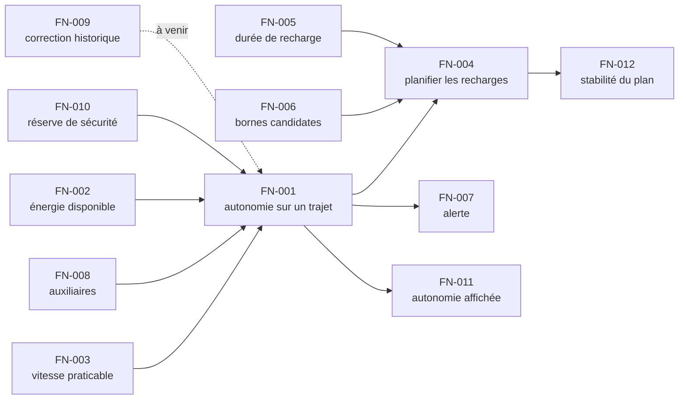

# Fil rouge — Découpage fonctionnel

*Sortie de l'atelier de découpage du 2026-02-03 · 2 h · 3 personnes du métier, 2
développeurs, 1 animateur · Méthode : [Guide 1 — Découper](../../guides/1-DECOUPER.md)*

---

## Périmètre

**Dans le périmètre** — tout ce qui concerne la question « **jusqu'où puis-je aller, et
où dois-je m'arrêter ?** », depuis les caractéristiques du véhicule et du trajet jusqu'au
plan de recharge proposé au conducteur.

**Hors périmètre** — le calcul de l'itinéraire lui-même (le trajet est fourni, découpé en
segments), la réservation d'une borne, le paiement, la supervision du réseau de bornes,
et le diagnostic de santé de la batterie.

> Le hors-périmètre a pris vingt minutes d'atelier sur cent vingt, et c'est normal : deux
> participants pensaient que le calcul d'itinéraire en faisait partie. Le découvrir en
> atelier coûte vingt minutes ; le découvrir en développement coûte trois semaines.

## Les fonctions identifiées

| Id | Fonction | Ce qu'elle produit | Propriétaire | Niveau |
|---|---|---|---|---|
| `FN-001` | **Estimer l'autonomie sur un trajet** | l'énergie consommée et le point où la réserve est atteinte | R&D Énergie | **4** |
| `FN-002` | **Estimer l'énergie disponible dans la batterie** | une énergie en kWh, à partir de l'état de charge et de la température | R&D Batterie | 3 |
| `FN-003` | **Estimer la vitesse praticable sur un segment** | une vitesse en km/h | Cartographie | 2 |
| `FN-004` | **Planifier les arrêts de recharge** | une suite d'arrêts, avec pour chacun la borne, l'état de charge visé et la durée | Expérience client | **3** |
| `FN-005` | **Estimer la durée d'une recharge** | une durée en minutes | R&D Batterie | 2 |
| `FN-006` | **Sélectionner les bornes candidates** | une liste de bornes atteignables et compatibles | Partenariats réseau | 1 |
| `FN-007` | **Décider du déclenchement d'une alerte d'autonomie** | une décision, et son motif | Expérience client | 1 |
| `FN-008` | **Estimer la consommation des auxiliaires** | une puissance en watts | R&D Thermique | 2 |
| `FN-009` | **Corriger l'estimation par l'historique du conducteur** | un facteur correctif | Science des données | 0 |
| `FN-010` | **Déterminer la réserve de sécurité applicable** | une énergie en kWh | Expérience client | 1 |
| `FN-011` | **Estimer l'autonomie affichée au tableau de bord** | une distance en km, arrondie | Expérience client | 1 |
| `FN-012` | **Décider de la stabilité d'un plan recalculé** | conserver le plan courant, ou le remplacer | Expérience client | 1 |

## Ce que ce tableau raconte

**Cinq propriétaires différents.** C'est le résultat le plus utile de l'atelier, et
personne ne l'avait anticipé : la réserve de sécurité (`FN-010`) et l'arrondi de
l'autonomie affichée (`FN-011`) appartiennent à l'**Expérience client**, pas à la R&D.
Ce sont des arbitrages entre rassurer et ne pas mentir — pas des questions de physique.
Avant l'atelier, ces deux décisions étaient prises implicitement dans le code, par des
développeurs, sans mandat.

**Un seul niveau 4.** `FN-001` est la seule fonction spécifiée complètement, parce que
c'est la seule dont une erreur laisse un conducteur en panne au bord de la route. Les
autres attendent d'en avoir besoin.

**Un niveau 0 assumé.** `FN-009` est identifiée et nommée, rien de plus. C'est un état
légitime : on sait qu'elle existe, on sait qui en est responsable, on n'a pas encore eu besoin
d'en savoir plus. L'écrire évite qu'elle soit redécouverte dans six mois comme une
surprise.

**Deux fonctions qui n'existaient pas avant l'atelier.** `FN-012` (« décider de la
stabilité d'un plan recalculé ») a été identifiée quand un développeur a demandé : *« et
si on recalcule un kilomètre plus loin et que le plan change, on affiche quoi ? »*.
Personne n'avait la réponse. C'est devenu une fonction, avec un propriétaire.

> **C'est la vraie valeur d'un atelier de découpage** : il ne cartographie pas seulement
> ce qui existe, il fait apparaître les décisions que personne n'avait jamais prises
> explicitement.

## Dépendances principales

`FN-001` est la fonction centrale : sept fonctions en dépendent ou l'alimentent. C'est
cohérent avec le fait qu'elle soit la seule au niveau 4 — et c'est le genre de
confirmation qu'on aime avoir.

## Décisions de nommage prises en atelier

| Nom écarté | Nom retenu | Pourquoi |
|---|---|---|
| « Gérer l'autonomie » | `FN-001` **Estimer l'autonomie sur un trajet** | « gérer » ne produit rien de nommable ; le paquet contenait en réalité `FN-001`, `FN-007` et `FN-011` |
| « Calculer la consommation » | `FN-001` **Estimer l'autonomie sur un trajet** | le résultat attendu n'est pas une consommation, c'est une réponse à « jusqu'où » |
| « Module de planification » | `FN-004` **Planifier les arrêts de recharge** | un module est un endroit, pas une fonction |
| « Traiter la température » | `FN-002` **Estimer l'énergie disponible dans la batterie** | la température est une entrée, pas un résultat |

> Le premier de ces quatre est le plus instructif : « Gérer l'autonomie » a occupé
> l'atelier pendant onze minutes avant que quelqu'un ne remarque qu'on parlait de trois
> choses différentes. **Un débat de nom qui s'éternise signale presque toujours plusieurs
> fonctions sous un seul mot.**

## Ce qui reste à faire

| Action | Qui | Quand |
|---|---|---|
| Monter `FN-004` au niveau 3 | Expérience client + R&D Batterie | prochain lot |
| Monter `FN-005` à `FN-008` au niveau 2 — leur contrat typé | leurs propriétaires métier | en continu |
| Trancher : `FN-009` doit-elle exister, ou est-ce une amélioration de `FN-001` ? | R&D Énergie | avant le prochain lot |

## Annexe — Identités

*Chaque objet porte un UUID attribué une fois et jamais modifié. L'identifiant lisible et le libellé sont des étiquettes : ils peuvent changer, l'identité non. Voir [CADRE.md §2.8](../../CADRE.md).*

| Identifiant | UUID | Nature | Libellé |
|---|---|---|---|
| `FN-001` | `11ce095c-f267-40b0-84cb-49c18037bc46` | fonction | Estimer l'autonomie sur un trajet |
| `FN-002` | `51de9dec-e41d-41e1-8ad8-33bde74395ba` | fonction | Estimer l'énergie disponible dans la batterie |
| `FN-003` | `ebcb0e0e-c74f-4ca2-9f0a-a61e481287db` | fonction | Estimer la vitesse praticable sur un segment |
| `FN-004` | `1e231894-98ee-40ef-a339-9ef41e368d51` | fonction | Planifier les arrêts de recharge |
| `FN-005` | `fbbac3a2-7aff-45d4-b0eb-01e0b507504f` | fonction | Estimer la durée d'une recharge |
| `FN-006` | `5f56cc79-2938-4faa-a6fe-10aa2b53d021` | fonction | Sélectionner les bornes candidates |
| `FN-007` | `a40abaf1-3b00-415d-85a0-60d6d269158d` | fonction | Décider du déclenchement d'une alerte d'autonomie |
| `FN-008` | `2d2ea0de-a006-4f2c-ad7e-79142b49f4da` | fonction | Estimer la consommation des auxiliaires |
| `FN-009` | `0746de64-53c0-4dce-a2d9-6c5f094f735e` | fonction | Corriger l'estimation par l'historique du conducteur |
| `FN-010` | `bc161b8d-1cb1-4f60-b57f-905bcc8384fe` | fonction | Déterminer la réserve de sécurité applicable |
| `FN-011` | `1205e307-b8b1-42a2-89af-adc518ad33a5` | fonction | Estimer l'autonomie affichée au tableau de bord |
| `FN-012` | `07708766-4c4c-4a21-88b9-947393dbf754` | fonction | Décider de la stabilité d'un plan recalculé |
