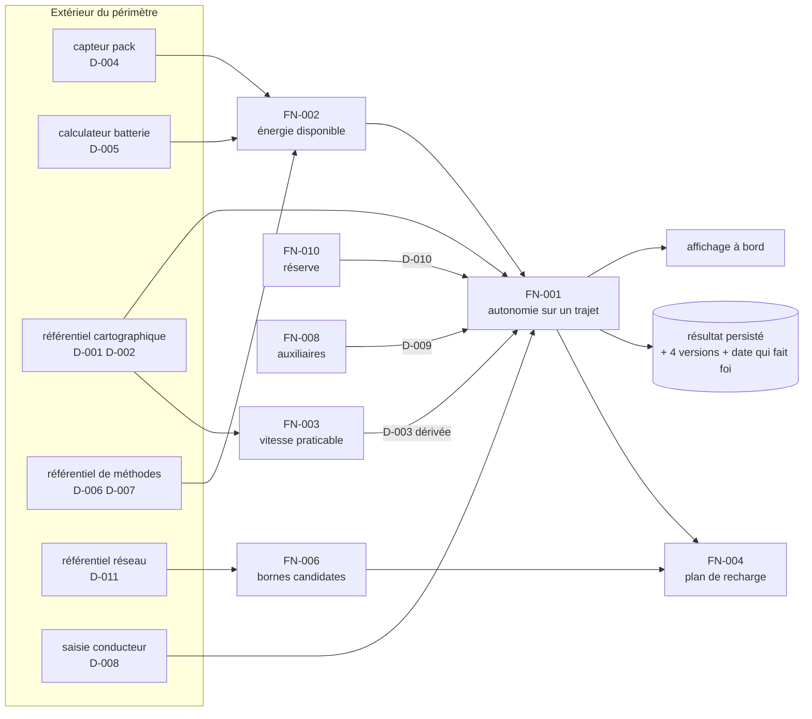

# Fil rouge — Cheminement des données

*Produit après le glossaire, avant l'écriture des règles.
Méthode : [Guide 3 — Le cheminement des données](../../guides/3-DONNEES.md)*

---

## Le catalogue

| Id | Donnée | Nature | Source de vérité | Propriétaire | Consommée par |
|---|---|---|---|---|---|
| `D-001` | Distance d'un segment | référentielle | référentiel cartographique | Cartographie | `FN-001`, `FN-004` |
| `D-002` | Pente d'un segment | référentielle | modèle numérique de terrain | Cartographie | `FN-001` |
| `D-003` | Vitesse praticable | **dérivée** | `FN-003` | Cartographie | `FN-001` |
| `D-004` | Température de la batterie | **mesurée** | capteur du pack | R&D Batterie | `FN-001`, `FN-002`, `FN-005` |
| `D-005` | État de charge | **mesurée** | calculateur de gestion batterie | R&D Batterie | `FN-001`, `FN-002`, `FN-004` |
| `D-006` | Capacité nominale | référentielle | fiche technique du véhicule | R&D Batterie | `FN-002` |
| `D-007` | Barème de facteur de température | référentielle | référentiel de méthodes | R&D Batterie | `FN-002` |
| `D-008` | Masse transportée | **saisie** | conducteur | Expérience client | `FN-001` |
| `D-009` | Puissance des auxiliaires | **dérivée** | `FN-008` | R&D Thermique | `FN-001` |
| `D-010` | Réserve de sécurité | **dérivée** | `FN-010` | Expérience client | `FN-001`, `FN-004` |
| `D-011` | Bornes : position, puissance, standard | référentielle | référentiel réseau partenaire | Partenariats réseau | `FN-004`, `FN-006` |

## Le diagramme

## Deux fiches remplies

### D-004 — Température de la batterie

| | |
|---|---|
| **Nature** | mesurée |
| **Source de vérité** | capteur du pack, valeur moyennée sur 60 s |
| **Propriétaire** | R&D Batterie |
| **Type** | `Température(°C, 1 décimale, −40,0 .. 80,0)` |
| **Date qui fait foi** | date d'**observation** — la valeur au moment du calcul |
| **Fraîcheur tolérée** | 5 minutes |
| **Si absente ou invalide** | **facteur le plus défavorable du barème (`P-04` = 0,700)**, et le conducteur en est informé |
| **Consommée par** | `FN-001`, `FN-002`, `FN-005` |
| **Si son unité change** | 3 fonctions à reprendre |
| **Si elle devient indisponible** | dégradation, pas de refus — voir ci-dessus |

> Le repli est **volontairement pessimiste**. Un repli sur 1,000, tout aussi
> « raisonnable » techniquement, aurait mis des conducteurs en panne.

### D-008 — Masse transportée

| | |
|---|---|
| **Nature** | saisie |
| **Source de vérité** | le conducteur, dans les réglages du véhicule |
| **Propriétaire** | Expérience client |
| **Type** | `Masse(kg, 1 décimale, 0,0 .. 600,0)` |
| **Date qui fait foi** | date de **saisie** — elle vaut jusqu'à la prochaine |
| **Fraîcheur tolérée** | **aucune limite** — c'est le problème, voir ci-dessous |
| **Si absente** | valeur par défaut : 150,0 kg *(2 occupants et des bagages)* |
| **Consommée par** | `FN-001` |

> **Ce que le catalogue a fait apparaître.** Personne ne met cette valeur à jour. Saisie
> une fois à la livraison, elle vaut encore trois ans plus tard. Une masse fausse de
> 300 kg change la consommation de près de 8 % en montée — soit davantage que plusieurs
> raffinements du modèle qu'on envisageait par ailleurs.
>
> Aucune règle de `SPEC-NRG-001` n'est en cause : **la donnée d'entrée est mauvaise, et
> aucun perfectionnement de l'algorithme ne le rattrapera.** C'est le genre de constat
> qu'on ne fait pas en écrivant des règles, et qu'on fait en traçant des données.

## Le tableau d'impact

| Donnée | Si son unité change | Si elle devient indisponible | Si sa source change |
|---|---|---|---|
| `D-001` distance | `FN-001`, `FN-004` | calcul refusé | nouvelle campagne de validation du modèle |
| `D-004` température | `FN-001`, `FN-002`, `FN-005` | repli pessimiste, conducteur informé | réétalonnage du barème `D-007` |
| `D-005` état de charge | `FN-001`, `FN-002`, `FN-004` | **calcul refusé** — rien n'est calculable sans lui | — |
| `D-007` barème | `FN-002` | dernière version connue, conducteur informé | version du jeu de paramètres à incrémenter |
| `D-011` bornes | `FN-004`, `FN-006` | plan de recharge indisponible, autonomie toujours calculée | — |

## Ce que l'exercice a produit

Trois constats, dont aucun n'était visible depuis les règles :

1. **`D-008` (masse transportée) n'est jamais rafraîchie.** Elle dégrade la prévision plus
   que ne l'améliorerait le raffinement du modèle qui était envisagé. La priorité du
   trimestre a changé après cette découverte.
2. **`D-005` (état de charge) était lu à deux endroits** : le calculateur batterie pour
   `FN-002`, et une trame réseau différente pour `FN-004`. Les deux valeurs divergeaient
   de 1 à 2 points. **Une donnée, une source** — la trame a été abandonnée.
3. **`D-007` (barème) n'avait pas de date d'effet.** Un rejeu relisait le barème courant
   et ne retrouvait pas le chiffre d'origine — le défaut de rejouabilité le plus fréquent,
   trouvé ici avant qu'un litige ne le trouve.

> Le cheminement des données ne produit aucune règle. Il produit des **questions que les
> règles ne posent pas** — et, ici, il a réorienté un trimestre de travail.

## Annexe — Identités

*Chaque objet porte un UUID attribué une fois et jamais modifié. L'identifiant lisible et le libellé sont des étiquettes : ils peuvent changer, l'identité non. Voir [CADRE.md §2.8](../../CADRE.md).*

| Identifiant | UUID | Nature | Libellé |
|---|---|---|---|
| `D-001` | `fee8faa0-b9ce-4143-bf50-e8088a7e549e` | donnée | Distance d'un segment |
| `D-002` | `cf84a1fd-0456-49e1-aa02-8d3e5a0c82c8` | donnée | Pente d'un segment |
| `D-003` | `6a2ac0bf-7a08-4a12-a6ff-e4d1d6c6ca33` | donnée | Vitesse praticable |
| `D-004` | `4fe93e69-adf6-4259-83a4-f512ac0dab4a` | donnée | Température de la batterie |
| `D-005` | `d872a024-bb34-49c3-ac45-ea1f6850cbe6` | donnée | État de charge |
| `D-006` | `cfa60adb-865a-4d05-a90e-2ef41dccff91` | donnée | Capacité nominale |
| `D-007` | `020f3f05-1312-4958-afab-3f7ab05141e2` | donnée | Barème de facteur de température |
| `D-008` | `8ba5f8ea-5633-4d47-86c9-f86b974a2b33` | donnée | Masse transportée |
| `D-009` | `09a35c99-8e7e-4d1d-b1e2-7dfe9b61926c` | donnée | Puissance des auxiliaires |
| `D-010` | `2562f4ae-0906-4c4b-b7ba-8c65f0796de4` | donnée | Réserve de sécurité |
| `D-011` | `c471ab89-7df3-4389-9749-a08abdeadc30` | donnée | Bornes : position, puissance, standard |
