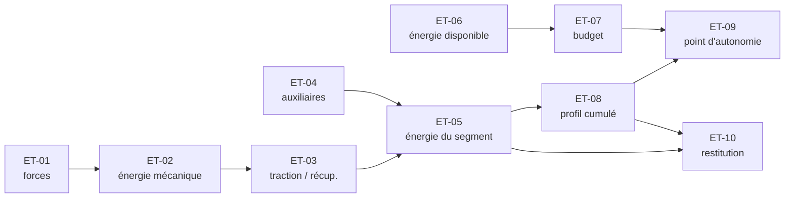

# SPEC-NRG-001 — Estimer l'autonomie sur un trajet

| | |
|---|---|
| **Identifiant** | SPEC-NRG-001 — spécifie `FN-001` |
| **Version** | 2.0.2 |
| **Statut** | Acceptée |
| **Niveau de maturité** | **4 — spécification complète** |
| **Auteur métier** | *(rôle : Responsable modèles énergétiques, R&D Énergie)* |
| **Valideur métier** | *(rôle : Direction R&D Énergie)* |
| **Co-auteur technique** | *(rôle : Architecte embarqué)* |
| **Date d'effet** | 2026-04-01 |
| **Glossaire de référence** | [Glossaire du domaine](2-GLOSSAIRE.md) v2.0.0 |
| **Jeu de paramètres** | Référentiel de méthodes v2026.2 |

> Fonction centrale du fil rouge *[L'autonomie d'un véhicule électrique](README.md)*.
> Le glossaire employé ici est celui du domaine : **[2-GLOSSAIRE.md](2-GLOSSAIRE.md)**.

---

## 1. Objectif et contexte

Répondre à la question du conducteur : **« jusqu'où puis-je aller sur ce trajet ? »**

La fonction produit l'énergie consommée segment par segment, l'énergie totale, et le
**point d'autonomie** — la distance à laquelle la réserve de sécurité est atteinte.

Elle est appelée dans deux situations très différentes (§11) : **à bord**, toutes les dix
secondes pendant la conduite, et **au sol**, avant le départ, pour préparer un plan de
recharge. Les deux doivent donner le même résultat sur les mêmes entrées.

## 2. Périmètre

**Dans le périmètre :** le modèle énergétique, la récupération, les auxiliaires, l'effet
de la température sur l'énergie disponible, la réserve de sécurité, le point d'autonomie.

**Hors périmètre :**
- Le calcul de l'itinéraire : le trajet est fourni, déjà découpé en segments.
- L'estimation de la vitesse praticable (`FN-003`) et de la puissance des auxiliaires
  (`FN-008`) : ce sont des entrées.
- La planification des recharges (`FN-004`).
- L'arrondi et la présentation de l'autonomie au tableau de bord (`FN-011`).
- Le vieillissement de la batterie : la capacité nominale est une entrée, supposée à jour.

## 3. Modèle et hypothèses

Le véhicule est traité comme un **point matériel en régime quasi-statique** : sur chaque
segment, la vitesse est constante, donc l'accélération est nulle et les forces
s'équilibrent.

| # | Hypothèse | Conséquence si elle est violée |
|---|---|---|
| H-1 | Vitesse constante sur un segment | Sous-estimation en conduite urbaine, où les accélérations dominent |
| H-2 | Pas de vent | Un vent de face de 20 km/h à 110 km/h majore la traînée d'environ 40 % |
| H-3 | Masse constante sur le trajet | Négligeable pour un véhicule électrique, qui ne s'allège pas en roulant |
| H-4 | Masse volumique de l'air constante | Écart de l'ordre de 10 % entre le niveau de la mer et 1 000 m d'altitude |
| H-5 | Rendements constants, indépendants du couple et du régime | Optimiste à très basse vitesse et en forte charge |

> Ces hypothèses sont **assumées, pas cachées**. C'est ce qui permet, plus tard,
> d'expliquer un écart entre la prévision et la réalité sans chercher un défaut dans le
> programme (§8.2).

## 4. Entrées

```
demande :
    trajet : liste ordonnée d'au moins 1 Segment
    vehicule :
        masse_a_vide          : Masse(kg, > 0, 1 décimale)
        masse_transportee     : Masse(kg, ≥ 0, 1 décimale)
        surface_frontale_cx   : Aire(m², > 0, 3 décimales)   — le produit Cx × S
        coefficient_roulement : Sansunité(> 0, 4 décimales)
        rendement_traction    : Fraction(0,000 .. 1,000, 3 décimales)
        rendement_recuperation: Fraction(0,000 .. 1,000, 3 décimales)
        capacite_nominale     : Énergie(kWh, > 0, 2 décimales)
    etat :
        etat_de_charge        : Fraction(0,000 .. 1,000, 3 décimales)
        temperature_batterie  : Température(°C, 1 décimale)
        puissance_auxiliaires : Puissance(W, ≥ 0, 1 décimale)   — produite par FN-008
    reserve_securite          : Énergie(kWh, ≥ 0, 2 décimales)  — produite par FN-010

Segment :
    distance          : Distance(km, > 0, 3 décimales)
    vitesse_praticable: Vitesse(km/h, > 0, 1 décimale)          — produite par FN-003
    pente             : Pourcentage(%, signé, 2 décimales)      — positif en montée
```

**Préconditions :**
- Le trajet contient au moins un segment.
- Les deux rendements sont strictement compris entre 0 et 1.
- `reserve_securite` est inférieure à l'énergie disponible calculée en `RG-060`.

## 5. Sorties

```
resultat :
    energie_totale        : Énergie(kWh, 4 décimales)      — peut être négative sur un trajet de descente
    consommation_moyenne  : Énergie(kWh/100 km, 3 décimales)
    energie_disponible    : Énergie(kWh, 4 décimales)
    budget_utilisable     : Énergie(kWh, 4 décimales)
    facteur_temperature   : Fraction(3 décimales)
    point_autonomie       : Distance(km, 3 décimales)      — absent si jamais atteint
    autonomie_atteinte    : Booléen
    energie_restante_arrivee : Énergie(kWh, 4 décimales)   — présent seulement si autonomie_atteinte est faux
    profil                : liste de ProfilSegment

ProfilSegment :
    index                 : Entier(≥ 1)
    energie_traction      : Énergie(kWh, 4 décimales)      — négative en récupération
    energie_auxiliaires   : Énergie(kWh, 4 décimales)
    energie_segment       : Énergie(kWh, 4 décimales)
    energie_cumulee       : Énergie(kWh, 4 décimales)
    duree                 : Durée(s, 1 décimale)
```

> Le `profil` est **une sortie de premier rang**, pas une trace de débogage. Il est exigé
> par la contrainte d'explicabilité (§11) : quand un conducteur conteste une estimation,
> on doit pouvoir lui montrer quel segment a consommé quoi.

## 6. Paramètres

| Id | Libellé | Valeur | Unité | Qui peut le changer | Circuit de validation | Fréquence | Date d'effet |
|---|---|---|---|---|---|---|---|
| `P-01` | Accélération de la pesanteur | 9,81 | m·s⁻² | *constante physique, non modifiable* | — | jamais | 2026-04-01 |
| `P-02` | Masse volumique de l'air de référence | 1,225 | kg·m⁻³ | R&D Énergie | Validation Direction R&D | rare | 2026-04-01 |
| `P-03` | Facteur de température — barème | voir `RG-060` | — | R&D Batterie | Comité modèles | 1 à 2 fois par an | 2026-04-01 |
| `P-04` | Facteur de température retenu si la mesure est indisponible | 0,700 | — | R&D Batterie | Comité modèles | rare | 2026-04-01 |

> `P-01` est une constante physique. Elle figure au tableau **précisément pour qu'on ne
> la prenne pas pour une valeur ajustable**, et elle est marquée non modifiable.
>
> `P-02` en revanche **n'est pas** une constante : c'est une valeur de référence choisie
> (air sec, 15 °C, niveau de la mer). Elle appartient à la R&D, et elle changera le jour
> où l'on décidera de tenir compte de l'altitude (`Q-02`).

## 7. Règles

### 7.1 La chaîne de traitement

Le calcul se lit comme dix boîtes qui s'enchaînent. Les six premières s'appliquent **à
chaque segment**, les quatre dernières **au trajet entier**.

| Étape | Consomme | Produit | Règles |
|---|---|---|---|
| `ET-01` Bilan des forces | `distance`, `vitesse_praticable`, `pente`, `masse_a_vide`, `masse_transportee`, `surface_frontale_cx`, `coefficient_roulement` | `force_totale` | `RG-010` |
| `ET-02` Énergie mécanique | `force_totale`, `distance` | `energie_mecanique` | `RG-020` |
| `ET-03` Traction et récupération | `energie_mecanique`, `rendement_traction`, `rendement_recuperation` | `energie_traction` | `RG-030` |
| `ET-04` Auxiliaires | `distance`, `vitesse_praticable`, `puissance_auxiliaires` | `duree`, `energie_auxiliaires` | `RG-040` |
| `ET-05` Énergie du segment | `energie_traction`, `energie_auxiliaires` | `energie_segment` | `RG-050` |
| `ET-06` Énergie disponible | `capacite_nominale`, `etat_de_charge`, `temperature_batterie` | `facteur_temperature`, `energie_disponible` | `RG-060` |
| `ET-07` Budget utilisable | `energie_disponible`, `reserve_securite` | `budget_utilisable` | `RG-070` |
| `ET-08` Profil cumulé | `energie_segment` | `index`, `energie_cumulee` | `RG-080` |
| `ET-09` Point d'autonomie | `energie_cumulee`, `budget_utilisable`, `distance` | `point_autonomie`, `autonomie_atteinte`, `energie_restante_arrivee` | `RG-090` |
| `ET-10` Restitution | `energie_segment`, `energie_cumulee`, `duree` | `energie_totale`, `consommation_moyenne`, `profil` | `RG-100` |

### Vue de niveau supérieur

Dix boîtes, c'est déjà trop pour une conversation. On les regroupe :

| Groupe | Étapes | Rôle |
|---|---|---|
| `GR-1` Consommation d'un segment | `ET-01` `ET-02` `ET-03` `ET-04` `ET-05` | ce que coûte un segment |
| `GR-2` Capital énergétique | `ET-06` `ET-07` | ce dont on dispose |
| `GR-3` Synthèse du trajet | `ET-08` `ET-09` `ET-10` | où l'on s'arrête, et ce qu'on restitue |

Un groupe est une **vue**, pas une fonction : il n'ajoute aucune règle et n'impose aucun
découpage du code. Ce qu'il consomme et produit vis-à-vis de l'extérieur se **déduit** de
ses étapes — les grandeurs qui ne servent qu'à l'intérieur du groupe disparaissent de la
vue, et c'est tout l'intérêt : `force_aerodynamique` ou `energie_mecanique` n'ont aucune
raison d'apparaître dans une discussion d'architecture.

```bash
java outils/Verifier.java --chaine exemples/fil-rouge/5-SPEC-NRG-001-autonomie.md
```

produit la table « qui crée / qui utilise » de chaque grandeur, contrôle `C-35` et `C-36`,
et engendre la vue groupée.

### Vue détaillée



> **Ce que la chaîne autorise, et qui ne se voit pas dans les règles.** `ET-06` et `ET-07`
> ne consomment rien de ce que produisent `ET-01` à `ET-05` : le budget peut donc se
> calculer **avant, après ou pendant** le parcours des segments, voire une seule fois pour
> tout le trajet au lieu d'une fois par segment. C'est une latitude d'implémentation
> réelle, et elle est ici **démontrée** plutôt que supposée.

### 7.2 Grandeurs internes

Résultats intermédiaires visibles **uniquement dans le corps de cette fonction**. Elles ne
figurent ni au contrat, ni au catalogue des données, ni dans la chaîne inter-étapes —
mais elles sont décrites avec la même rigueur.

```
masse                : Flottant(kg, 6 chiffres significatifs, > 0)
v                    : Flottant(m·s⁻¹, 6 chiffres significatifs, > 0)
alpha                : Flottant(rad, 6 chiffres significatifs, −0,30 .. 0,30)
d                    : Flottant(m, 6 chiffres significatifs, > 0)
force_aerodynamique  : Flottant(N, 6 chiffres significatifs, ≥ 0)
force_roulement      : Flottant(N, 6 chiffres significatifs, ≥ 0)
force_pente          : Flottant(N, 6 chiffres significatifs)          — signée
energie_mecanique    : Flottant(J, 6 chiffres significatifs)          — signée
```

> `force_pente` et `energie_mecanique` sont **signées**, et c'est ce signe qui porte toute
> la récupération (`RG-030`). Une plage déclarée `≥ 0` par distraction rendrait le modèle
> incapable de représenter une descente — le genre d'erreur qu'on ne trouve qu'en
> déclarant les internes.

### RG-010 — Bilan des forces sur un segment

```
LET masse   = masse_a_vide + masse_transportee                          (kg)
LET v       = vitesse_praticable ÷ 3,6                                  (m·s⁻¹)
LET alpha   = arctangente( pente ÷ 100 )                                (rad)

    force_aerodynamique  = ½ × P-02 × surface_frontale_cx × v²                        (N)
    force_roulement  = coefficient_roulement × masse × P-01 × cosinus(alpha)      (N)
    force_pente = masse × P-01 × sinus(alpha)                                (N)

    force_totale = force_aerodynamique + force_roulement + force_pente                                 (N)
```

`force_pente` est **signée** : négative en descente. C'est ce signe qui rend le modèle
capable de représenter la récupération, et c'est lui qui fait de `RG-030` une règle non
linéaire.

> **Le piège d'unité.** `vitesse_praticable` est en km/h, `v` en m/s. Le facteur 3,6 est
> écrit explicitement dans la règle, et le jeu d'essai contient la vitesse dans les deux
> unités (`CT-01`). Une confusion km/h ↔ m/s produit une erreur d'un facteur 13 sur la
> traînée — assez grande pour être trouvée tout de suite, ce qui est une chance.

### RG-020 — Énergie mécanique du segment

```
LET d = distance × 1000                                                 (m)

    energie_mecanique = force_totale × d                                           (J)
```

### RG-030 — Traction et récupération

```
IF energie_mecanique > 0 THEN
    energie_traction = energie_mecanique ÷ rendement_traction                        (J, positif)
ELSE
    energie_traction = energie_mecanique × rendement_recuperation                    (J, négatif)
END IF
```

> **C'est la seule non-linéarité du modèle, et elle est essentielle.** En traction, les
> pertes *augmentent* l'énergie prélevée sur la batterie : on divise par le rendement. En
> récupération, les pertes *diminuent* l'énergie rendue : on multiplie. Écrire une seule
> formule pour les deux cas — l'erreur classique — donne un véhicule qui récupère 111 %
> de l'énergie de la descente, c'est-à-dire un mouvement perpétuel.

### RG-040 — Auxiliaires

```
LET duree = d ÷ v                                                       (s)

    energie_auxiliaires = puissance_auxiliaires × duree                        (J)
```

Les auxiliaires consomment **par unité de temps**, pas par unité de distance. Rouler plus
lentement augmente donc leur part — voir la note de `INV-05`, qui en tire une conséquence
contre-intuitive.

### RG-050 — Énergie d'un segment

```
    energie_segment = ( energie_traction + energie_auxiliaires ) ÷ 3 600 000               (kWh)
```

**Aucun arrondi n'est appliqué ici**, ni à aucune étape intermédiaire. Les arrondis
n'interviennent qu'à la production des sorties (`RG-100`).

### RG-060 — Énergie disponible et facteur de température

Le barème `P-03` s'applique par **paliers**, bornes supérieures incluses :

| Température de la batterie | Facteur |
|---|---|
| `T ≤ −10,0 °C` | 0,700 |
| `−10,0 °C < T ≤ 0,0 °C` | 0,800 |
| `0,0 °C < T ≤ 10,0 °C` | 0,900 |
| `10,0 °C < T ≤ 30,0 °C` | 1,000 |
| `T > 30,0 °C` | 0,950 |

```
    energie_disponible = capacite_nominale × etat_de_charge × facteur_temperature
```

**Aucune interpolation entre paliers.** Une variation d'un dixième de degré peut donc
faire basculer le résultat d'un palier à l'autre — c'est assumé, et c'est l'objet de
`Q-01`.

> **Pourquoi des paliers plutôt qu'une courbe.** Le barème vient de campagnes d'essais
> menées à quelques températures. Interpoler donnerait une illusion de précision que les
> mesures ne portent pas. Le métier a préféré une marche visible à une continuité
> inventée.

Si la température de la batterie est indisponible, on retient `P-04` = 0,700, **le
facteur le plus défavorable du barème** — voir §11, mode dégradé.

### RG-070 — Budget utilisable

```
    budget_utilisable = energie_disponible − reserve_securite
```

### RG-080 — Profil cumulé

```
index = rang du segment dans le trajet, à partir de 1

    energie_cumulee(0) = 0
    energie_cumulee(i) = energie_cumulee(i − 1) + energie_segment(i)

L'accumulation est indexée, jamais écrasée : energie_cumulee(i) désigne une
valeur et une seule, pour toujours.
```

L'énergie cumulée **n'est pas monotone** : un segment de descente prononcée la fait
diminuer. Toute implémentation qui suppose une suite croissante — pour faire une
recherche dichotomique, par exemple — est fausse.

### RG-090 — Point d'autonomie

```
Le POINT D'AUTONOMIE est la distance, depuis le départ, du PREMIER point
où l'énergie cumulée atteint le budget utilisable.

L'ordre du trajet tient lieu de règle de départage : les segments sont totalement
ordonnés, donc « le premier » désigne un segment et un seul. Aucune égalité n'est
possible.

On parcourt les segments dans l'ordre. Pour un segment donné, l'énergie déjà
consommée à son entrée est celle de tous les segments qui le précèdent :

    LET energie_cumulee_avant = SUM OF energie_segment OVER segments
                                 qui précèdent le segment courant

Pour le premier segment tel que
    energie_cumulee_avant + energie_segment ≥ budget_utilisable
   AND energie_segment > 0 :

    LET fraction = ( budget_utilisable − energie_cumulee_avant ) ÷ energie_segment
    point_autonomie = distance cumulée avant ce segment + fraction × distance du segment
    autonomie_atteinte = vrai

IF aucun segment ne satisfait cette condition THEN
    autonomie_atteinte = faux
    point_autonomie n'est pas produit
    energie_restante_arrivee = budget_utilisable − energie_totale
ELSE
    autonomie_atteinte = vrai
    energie_restante_arrivee n'est pas produite
END IF
```

Deux points que la formulation tranche explicitement :

- **« le premier »**, et non « celui où l'on finit en dessous ». Une descente ultérieure
  peut ramener l'énergie cumulée sous le budget ; **elle ne rend pas l'autonomie déjà
  consommée**. Le conducteur est passé sur sa réserve, le fait est acquis.
- **`ET energie_segment > 0`** : sur un segment de récupération, l'énergie cumulée diminue ; il
  ne peut pas contenir le point de franchissement, et l'interpolation y serait absurde.

L'interpolation est **affine à l'intérieur du segment**, ce qui est cohérent avec
l'hypothèse `H-1` de vitesse et de pente constantes : sur un segment, l'énergie se
consomme uniformément avec la distance.

### RG-100 — Arrondis et sens des arrondis

| Grandeur | Décimales | Sens |
|---|---|---|
| Énergies (`kWh`) | 4 | au plus proche |
| Consommation moyenne (`kWh/100 km`) | 3 | au plus proche |
| Durées (`s`) | 1 | au plus proche |
| **`point_autonomie` (`km`)** | 3 | **vers le bas, toujours** |

> **Le point d'autonomie s'arrondit vers le bas, jamais au plus proche.** Ce n'est pas
> une convention de calcul : c'est une règle de sécurité. Une estimation optimiste de
> quelques mètres n'a aucune conséquence sur un tableur, et en a une sur une voie rapide.
>
> Cette règle est le meilleur exemple, dans tout ce dépôt, d'une décision qui **paraît
> technique et ne l'est pas**. Elle appartient à l'Expérience client, elle est écrite,
> elle est datée, et elle ne sera jamais « optimisée » par un développeur pressé.

## 8. Invariants et critères d'acceptation numérique

### 8.1 Invariants

| Id | Propriété |
|---|---|
| `INV-01` | Sur un segment de pente positive ou nulle, `energie_segment > 0` |
| `INV-02` | **Additivité** : découper un segment en deux moitiés de mêmes vitesse et pente donne exactement la même énergie que le segment entier |
| `INV-03` | **Homogénéité** : à vitesse et pente égales, doubler la distance double `energie_traction` et `energie_auxiliaires` |
| `INV-04` | **Symétrie de la pente** : un aller-retour sur un même segment consomme strictement plus que deux fois le même segment à plat — la récupération ne compense jamais la montée |
| `INV-05` | **Monotonie vis-à-vis de la vitesse, au-delà de la vitesse de consommation minimale** : voir la note ci-dessous |
| `INV-06` | `point_autonomie`, s'il existe, est compris entre 0 et la longueur totale du trajet |
| `INV-07` | Le calcul est déterministe : mêmes entrées, mêmes sorties, profil compris |
| `INV-08` | Le calcul est **pur** : aucun appel successif ne dépend d'un appel précédent |

> **La subtilité de `INV-05`, et pourquoi elle est écrite.** On croit spontanément que
> rouler moins vite consomme toujours moins. C'est faux : la traînée décroît avec la
> vitesse, mais les auxiliaires consomment *par unité de temps*, donc leur part par
> kilomètre augmente quand on ralentit. Il existe une **vitesse de consommation
> minimale**, autour de **30 km/h** avec les paramètres du jeu d'essai — en dessous,
> ralentir coûte plus cher. `CT-06` le vérifie.
>
> Un invariant « la consommation croît avec la vitesse » écrit sans cette réserve serait
> **faux**, et son test de propriété échouerait sur des entrées parfaitement légitimes.
> C'est exactement le genre d'erreur qu'une relecture par un pair métier attrape et
> qu'une relecture technique laisse passer.

### 8.2 Trois niveaux d'exactitude

| | **Reproductibilité** | **Justesse numérique** | **Validité du modèle** |
|---|---|---|---|
| Question | Les deux implémentations, embarquée et serveur, donnent-elles le même nombre ? | Le nombre est-il la vraie valeur des formules du §7 ? | Le modèle décrit-il la consommation réelle ? |
| S'évalue contre | Cette spécification | Le calcul à la main du §10 | Des mesures sur piste et sur route |
| Tolérance | **10⁻⁹ relatif**, égalité stricte sur les indicateurs et le nombre de segments | **10⁻⁹ relatif** — les formules sont fermées, il n'y a aucune méthode approchée | **± 8 %** sur l'énergie totale, sur le parcours de référence homologué |
| Un dépassement signifie | Une implémentation n'est pas conforme, **ou la spécification est ambiguë** | Une erreur de codage des formules | Les hypothèses `H-1` à `H-5` sont sorties de leur domaine — **pas un défaut du programme** |
| Se contrôle | À chaque livraison, sur les deux implémentations | À chaque livraison | Deux fois par an, avec la R&D |

> Les ± 8 % de la troisième colonne sont la vraie incertitude du produit. Le conducteur
> qui constate 6 % d'écart n'a pas trouvé un bogue : il a rencontré `H-2`, le vent.
> **Sans cette colonne, l'équipe passe son temps à chercher des défauts dans du code
> correct.**

## 9. Cas d'erreur métier

| Code | Condition | Conséquence | Message |
|---|---|---|---|
| `E-TRAJET-001` | Le trajet ne contient aucun segment | Aucun résultat | « Aucun trajet à analyser. » |
| `E-TRAJET-002` | Un segment a une distance ou une vitesse nulle ou négative | Aucun résultat | « Le trajet contient un segment invalide. » |
| `E-VEHIC-001` | Un rendement est hors de l'intervalle `]0 ; 1[` | Aucun résultat | « Les caractéristiques du véhicule sont invalides. » |
| `E-RESERVE-001` | La réserve de sécurité est supérieure ou égale à l'énergie disponible | Aucun résultat | « L'énergie disponible ne permet pas de rouler. » |

## 10. Jeu d'essai

### Provenance et validation des résultats attendus

| | |
|---|---|
| **Provenance** | **Solution analytique.** Les formules du §7 sont fermées : aucune méthode approchée n'intervient |
| **Comment ils ont été examinés** | Recalculés à la main, étape par étape, à la calculatrice scientifique ; le cas riche `CT-01` a été refait par un second lecteur |
| **Validés par** | *(rôle : Direction R&D Énergie)* |
| **Le** | 2026-02-24 |
| **Pour la version** | 1.0.0, reconduits en 2.0.0 et 2.0.1 |

*Ces résultats sont des **données de référence** : ils qualifient le code et servent
de base de non-régression. Ils ne se modifient que par une revalidation métier datée
([CADRE §5](../../CADRE.md)).*

**Construction de l'oracle.** Les formules du §7 sont **fermées** : aucune méthode
approchée n'intervient. Les valeurs ci-dessous sont donc calculables à la main, étape par
étape, et n'ont été produites par aucune implémentation. Une calculatrice scientifique
suffit à les refaire.

**Véhicule de référence**, utilisé dans tous les cas :

| Grandeur | Valeur |
|---|---|
| Masse à vide + transportée | 1 800,0 kg |
| Surface frontale × Cx | 0,640 m² |
| Coefficient de roulement | 0,0100 |
| Rendement de traction | 0,900 |
| Rendement de récupération | 0,600 |
| Capacité nominale | 60,00 kWh |
| Puissance des auxiliaires | 500,0 W |

**Trajet de référence**, 4 segments, 125,0 km :

| # | Distance | Vitesse praticable | Pente |
|---|---|---|---|
| 1 | 100,000 km | 110,0 km/h | 0,00 % |
| 2 | 10,000 km | 90,0 km/h | +3,00 % |
| 3 | 10,000 km | 90,0 km/h | −3,00 % |
| 4 | 5,000 km | 50,0 km/h | 0,00 % |

### Vue d'ensemble

| Id | Ce qu'il exerce | Résultat attendu |
|---|---|---|
| `CT-01` | Le bilan des forces et l'énergie, segment par segment | **20,5060 kWh** sur 125 km |
| `CT-02` | La récupération en descente (`RG-030`) | segment 3 : **−0,1244 kWh** |
| `CT-03` | Le point d'autonomie avec interpolation dans le segment 2 | **106,017 km** |
| `CT-04` | L'effet de la température (`RG-060`) sur le même trajet | **82,555 km** |
| `CT-05` | Autonomie jamais atteinte | `autonomie_atteinte = faux`, reste **1,4940 kWh** |
| `CT-06` | La vitesse de consommation minimale (`INV-05`) | minimum à **≈ 29,9 km/h** |
| `CT-07` | Température indisponible → facteur le plus défavorable | facteur **0,700** |
| `CT-08` | Trajet vide | erreur `E-TRAJET-001` |

### CT-01 — Bilan complet, segment par segment

`etat_de_charge = 1,000`, `temperature_batterie = 20,0 °C`.

**Segment 1** — 100,000 km à 110,0 km/h, pente nulle. Détail complet :

| Étape | Calcul | Résultat |
|---|---|---|
| `v` | `110,0 ÷ 3,6` | 30,5556 m·s⁻¹ |
| `force_aerodynamique` | `0,5 × 1,225 × 0,640 × 30,5556²` | 365,99 N |
| `force_roulement` | `0,0100 × 1800 × 9,81 × cos(0)` | 176,58 N |
| `force_pente` | `1800 × 9,81 × sin(0)` | 0,00 N |
| `force_totale` | | **542,57 N** |
| `energie_mecanique` | `542,57 × 100 000` | 54,2568 MJ |
| `energie_traction` | `54,2568 ÷ 0,900` | 60,2853 MJ → **16,7459 kWh** |
| `duree` | `100 000 ÷ 30,5556` | 3 272,7 s |
| `energie_auxiliaires` | `500,0 × 3 272,7` | 1,6364 MJ → **0,4545 kWh** |
| **`energie_segment`** | | **17,2005 kWh** |

**Les quatre segments :**

| # | `force_aerodynamique` | `force_roulement` | `force_pente` | `force_totale` | `energie_traction` | `energie_auxiliaires` | **`energie_segment`** | `energie_cumulee` |
|---|---|---|---|---|---|---|---|---|
| 1 | 365,99 | 176,58 | 0,00 | 542,57 | 16,7459 | 0,4545 | **17,2005** | 17,2005 |
| 2 | 245,00 | 176,50 | +529,50 | 951,00 | 2,9352 | 0,0556 | **2,9907** | 20,1912 |
| 3 | 245,00 | 176,50 | −529,50 | −108,00 | −0,1800 | 0,0556 | **−0,1244** | 20,0668 |
| 4 | 75,62 | 176,58 | 0,00 | 252,20 | 0,3892 | 0,0500 | **0,4392** | 20,5060 |

- **`energie_totale` = 20,5060 kWh**
- **`consommation_moyenne` = 16,405 kWh/100 km**

> Notez la colonne `energie_cumulee` : elle **décroît** entre les segments 2 et 3. C'est
> `RG-080` en action, et c'est ce qui interdit toute recherche dichotomique.

### CT-02 — La récupération

Segment 3 isolé — 10,000 km à 90,0 km/h, pente −3,00 % :

| Étape | Calcul | Résultat |
|---|---|---|
| `alpha` | `arctan(−0,03)` | −0,029991 rad |
| `force_pente` | `1800 × 9,81 × sin(−0,029991)` | −529,50 N |
| `force_totale` | `245,00 + 176,50 − 529,50` | **−108,00 N** |
| `energie_mecanique` | `−108,00 × 10 000` | −1,0800 MJ |
| `energie_traction` | `energie_mecanique ≤ 0` → **on multiplie** : `−1,0800 × 0,600` | −0,6480 MJ → **−0,1800 kWh** |
| `energie_auxiliaires` | `500,0 × 400,0` | **+0,0556 kWh** |
| **`energie_segment`** | | **−0,1244 kWh** |

> **Le détecteur d'erreur.** Une implémentation qui diviserait par le rendement dans les
> deux branches donnerait ici `−1,0800 ÷ 0,600 = −1,8000 MJ`, soit **−0,5000 kWh** : le
> véhicule récupérerait presque trois fois plus que ce que la descente lui donne. Ce
> seul cas de test suffit à l'attraper.

### CT-03 — Point d'autonomie, interpolation dans le segment 2

`etat_de_charge = 0,400`, `temperature_batterie = 20,0 °C`, `reserve_securite = 5,00 kWh`.

| Étape | Calcul | Résultat |
|---|---|---|
| `facteur_temperature` | `10,0 < 20,0 ≤ 30,0` | 1,000 |
| `energie_disponible` | `60,00 × 0,400 × 1,000` | 24,0000 kWh |
| `budget_utilisable` | `24,0000 − 5,00` | **19,0000 kWh** |
| Premier segment franchi | `17,2005 < 19,0000 ≤ 20,1912` | le **segment 2** |
| `fraction` | `(19,0000 − 17,2005) ÷ 2,9907` = `1,7995 ÷ 2,9907` | 0,601702 |
| **`point_autonomie`** | `100,000 + 0,601702 × 10,000` | **106,017 km** |

*(arrondi vers le bas à 3 décimales, `RG-100` — la valeur exacte est 106,01702…)*

### CT-04 — Le même trajet par −5 °C

Mêmes entrées que `CT-03`, mais `temperature_batterie = −5,0 °C`.

| Étape | Calcul | Résultat |
|---|---|---|
| `facteur_temperature` | `−10,0 < −5,0 ≤ 0,0` | **0,800** |
| `energie_disponible` | `60,00 × 0,400 × 0,800` | 19,2000 kWh |
| `budget_utilisable` | `19,2000 − 5,00` | **14,2000 kWh** |
| Premier segment franchi | `14,2000 ≤ 17,2005` | le **segment 1** |
| `fraction` | `14,2000 ÷ 17,2005` | 0,825559 |
| **`point_autonomie`** | `0,000 + 0,825559 × 100,000` | **82,555 km** |

> **23,5 km perdus pour 25 degrés de moins**, sans que rien d'autre ne change. Tous les
> conducteurs de véhicule électrique connaissent cet effet ; peu savent qu'il porte
> uniquement sur l'énergie *disponible*, pas sur la consommation. La spécification le dit,
> et le cas de test le chiffre.

### CT-05 — Autonomie jamais atteinte

Mêmes entrées que `CT-03`, mais `etat_de_charge = 0,450`.

| Étape | Calcul | Résultat |
|---|---|---|
| `energie_disponible` | `60,00 × 0,450 × 1,000` | 27,0000 kWh |
| `budget_utilisable` | `27,0000 − 5,00` | 22,0000 kWh |
| Comparaison | `20,5060 < 22,0000` sur tout le trajet | jamais franchi |
| `autonomie_atteinte` | | **faux** |
| `point_autonomie` | | **non produit** |
| `energie_restante_arrivee` | `22,0000 − 20,5060` | **1,4940 kWh** |

### CT-06 — La vitesse de consommation minimale

Segment plat de 100 km, en faisant varier la seule vitesse praticable :

| Vitesse | Consommation |
|---|---|
| 10,0 km/h | 10,543 kWh/100 km |
| 20,0 km/h | 8,323 kWh/100 km |
| **29,9 km/h** | **7,957 kWh/100 km** ← minimum |
| 40,0 km/h | 8,194 kWh/100 km |
| 60,0 km/h | 9,644 kWh/100 km |
| 110,0 km/h | 17,200 kWh/100 km |

La vitesse du minimum vaut `∛( rendement_traction × puissance_auxiliaires ÷
( P-02 × surface_frontale_cx ) )` = **8,3106 m·s⁻¹ = 29,92 km/h**.

> Ce cas vérifie `INV-05` **et sa réserve**. Un test de propriété qui affirmerait « la
> consommation croît avec la vitesse » échouerait entre 10 et 30 km/h — sur des entrées
> parfaitement valides. Mieux vaut le découvrir ici que dans un rapport de bogue.

### CT-07 — Température indisponible

`temperature_batterie` absente → `facteur_temperature = P-04 = 0,700`, **le plus
défavorable du barème**. Avec `etat_de_charge = 0,400` : `energie_disponible = 16,8000
kWh`, `budget_utilisable = 11,8000 kWh`, `point_autonomie = 68,602 km`.

> Le sens du repli est une décision métier explicite : **en l'absence d'information, on
> choisit toujours l'hypothèse défavorable au véhicule.** Un repli sur 1,000 aurait été
> tout aussi « raisonnable » techniquement, et aurait mis des conducteurs en panne.

### CT-08 — Trajet vide

→ **erreur `E-TRAJET-001`**, aucun résultat.

### Table de couverture

| Règle | Couverte par | | Règle | Couverte par |
|---|---|---|---|---|
| `RG-010` | CT-01, CT-02, CT-06 | | `RG-070` | CT-03, CT-04, CT-05 |
| `RG-020` | CT-01 | | `RG-080` | CT-01 |
| `RG-030` | **CT-02** (les deux branches) | | `RG-090` | CT-03, CT-04, CT-05 |
| `RG-040` | CT-01, CT-06 | | `RG-100` | CT-03, CT-04 |
| `RG-050` | tous | | `INV-02` à `INV-05` | tests de propriété + CT-06 |
| `RG-060` | CT-03, CT-04, CT-07 | | `E-VEHIC-001`, `E-RESERVE-001` | *non couverts — `Q-04`* |

## 11. Contraintes et exigences

### 11.1 Contraintes métier

Deux usages, **une seule spécification** — et deux implémentations qui doivent coïncider
au milliardième.

| Dimension | **Embarqué** (calculateur du véhicule) | **Serveur** (préparation du trajet) |
|---|---|---|
| **Volumétrie** | 1 calcul toutes les 10 s pendant la conduite ; trajets jusqu'à **3 000 segments** | 4 millions de trajets par jour, jusqu'à 3 000 segments |
| **Mode d'appel** | Périodique, **à bord, sans réseau** | À la demande, synchrone |
| **Latence** | **Moins de 20 ms**, sur un calculateur automobile — pas un serveur | moins de 300 ms au 95ᵉ centile |
| **Énergie et mémoire** | **Contrainte forte** : quelques centaines de kilo-octets, pas d'allocation dynamique pendant le calcul | sans contrainte |
| **Exactitude** | Voir §8.2. Reproductibilité **10⁻⁹** entre les deux implémentations | identique |
| **Déterminisme** | Strict (`INV-07`), profil compris | identique |
| **Stabilité** | **Deux calculs successifs séparés de 10 s, sur un véhicule qui a peu avancé, ne doivent pas produire un point d'autonomie qui varie de plus de 2 km.** Un affichage qui oscille est jugé défaillant par le conducteur, même s'il est juste | sans objet |
| **Rejouabilité** | **5 ans.** Tout véhicule immobilisé faute d'énergie fait l'objet d'une analyse : entrées, paramètres et version de spécification doivent permettre de rejouer le calcul à l'identique | identique |
| **Auditabilité** | Le `profil` complet est journalisé à bord pour les 100 derniers kilomètres | conservé avec le trajet |
| **Explicabilité** | Le conducteur doit pouvoir voir quel segment consomme quoi | identique |
| **Criticité et mode dégradé** | **Température indisponible → facteur le plus défavorable `P-04`, et le conducteur en est informé.** Vitesse praticable indisponible sur un segment → on retient la limitation réglementaire. **Jamais de repli optimiste** | identique |
| **Confidentialité** | Aucune donnée personnelle dans le calcul. Le trajet, lui, en est une : il ne sort pas du véhicule sans consentement — d'où l'existence même de la variante embarquée | le trajet est pseudonymisé |
| **Conformité** | Les valeurs d'autonomie communiquées au conducteur ne doivent pas être présentées comme des valeurs homologuées (voir l'homonyme *autonomie* au glossaire) | identique |
| **Fréquence de changement** | `P-02` à `P-04` : 1 à 2 fois par an. Règles : rare, mais toute évolution du modèle passe par ce document | identique |
| **Qui modifie** | La R&D doit pouvoir réviser le barème de température **sans remise à jour du calculateur** — barème téléchargé, versionné, daté | identique |
| **Durée de vie** | **15 ans** — la durée de vie d'un véhicule | 10 ans |

### 11.2 Exigences de réalisation

Reçues de la Direction sûreté, de l'Architecture véhicule et de la Protection des
données. Le métier ne les a pas écrites : il les intègre, parce que c'est ce document que
le développement lira.

| Id | Exigence | Source | Qui la valide | Vérification |
|---|---|---|---|---|
| `EX-01` | Le logiciel du calculateur est écrit dans le sous-ensemble **MISRA C:2012**, catégories obligatoires et requises | Politique de sûreté logicielle `DIR-SUR-004` | Direction Sûreté | Analyse statique **bloquante** en intégration continue |
| `EX-02` | **Aucune allocation dynamique de mémoire** après la phase d'initialisation | `DIR-SUR-004` §4.2 | Direction Sûreté | Analyse statique + revue de conception |
| `EX-03` | Le temps d'exécution **pire cas** est borné, mesuré sur cible, et documenté | `DIR-SUR-004` §6 | Direction Sûreté | Mesure sur banc, à chaque livraison |
| `EX-04` | La fonction s'exécute dans la **partition non critique** du calculateur ; elle ne peut ni lire ni écrire dans la partition de commande | Architecture de sûreté `ARC-VEH-11` | Architecture véhicule | Revue d'architecture + test de cloisonnement |
| `EX-05` | La fonction dispose d'au plus **512 Ko de mémoire vive** et ne suppose aucun ramasse-miettes | `ARC-VEH-11` §3 | Architecture véhicule | Mesure d'empreinte à chaque livraison |
| `EX-06` | Le **trajet est une donnée personnelle de catégorie C2** : il ne quitte pas le véhicule sans consentement explicite, et n'est jamais journalisé sous forme non agrégée | Politique de protection des données `POL-DCP-2` | Protection des données | Revue de conformité annuelle + revue de code sur les points de journalisation |
| `EX-07` | Les données de la partition non critique et celles de la partition de commande sont **stockées séparément**, sans canal de communication autre que l'interface déclarée | `ARC-VEH-11` §5 | Architecture véhicule | Test de cloisonnement |
| `EX-08` | Le service serveur emploie un langage de la **liste technique approuvée** `LTA-2026` | Comité d'architecture | Architecture SI | Revue d'architecture avant mise en service |
| `EX-09` | La **couverture des tests** du code embarqué atteint 100 % des branches sur les fonctions de calcul | `DIR-SUR-004` §7 | Direction Sûreté | Rapport de couverture, bloquant |

> **Un conflit à arbitrer.** `EX-08` renvoie à une liste approuvée qui contient
> majoritairement des environnements à ramasse-miettes, tandis que la contrainte métier de
> latence côté serveur (300 ms au 95ᵉ centile) reste tenable — mais la contrainte de
> **reproductibilité au milliardième** entre les deux implémentations, elle, exige un
> comportement numérique identique à celui du C embarqué. Le point est ouvert en `Q-06`.

## 12. Questions ouvertes

| Id | Question | Décideur | Échéance | Statut |
|---|---|---|---|---|
| `Q-01` | Le barème de température procède par paliers (`RG-060`). Un dixième de degré peut faire varier l'autonomie de plusieurs kilomètres, ce qui peut heurter la contrainte de **stabilité** du §11. Faut-il interpoler, ou introduire une hystérésis ? | R&D Batterie | 2026-06-30 | Ouverte |
| `Q-02` | La masse volumique de l'air (`P-02`) est fixe. Faut-il la corriger de l'altitude, connue du trajet ? Gain estimé : 3 à 4 % en montagne | R&D Énergie | 2026-09-30 | Ouverte |
| `Q-03` | `H-2` suppose l'absence de vent. Les prévisions météorologiques sont disponibles côté serveur, pas à bord. Introduire le vent créerait **deux résultats différents** pour les deux usages — ce que le §8.2 interdit aujourd'hui | Direction R&D | 2026-12-31 | Ouverte |
| `Q-04` | `E-VEHIC-001` et `E-RESERVE-001` ne sont couverts par aucun cas de test | Auteur métier | 2026-05-31 | Ouverte |
| `Q-06` | `EX-08` impose une liste technique approuvée côté serveur, alors que `EX-01` impose du C MISRA à bord. La reproductibilité de 10⁻⁹ entre les deux implémentations (§8.2) est-elle tenable avec tous les langages de la liste, ou faut-il restreindre celle-ci pour cette fonction ? | Architecture SI **et** Direction Sûreté | 2026-07-31 | Ouverte |
| `Q-05` | *Tranchée le 2026-03-12 :* le point d'autonomie s'arrondit-il au plus proche ou vers le bas ? → **vers le bas**, sans exception (`RG-100`) | Expérience client | — | Fermée |

## 13. Historique et notices de changement

| Version | Date | Changement | Impact sur les résultats | Notice |
|---|---|---|---|---|
| 1.0.0 | 2026-02-24 | Version initiale | — | — |
| **2.0.0** | 2026-03-12 | `RG-100` : arrondi du point d'autonomie vers le bas (`Q-05`) | **Oui** — jusqu'à 1 m, toujours dans le sens prudent | `N-2.0.0` |
| 2.0.1 | 2026-03-20 | Reprise de `RG-050` et `RG-090` : le terme *consommation moyenne* est remplacé par une formulation explicite de l'assiette, à la suite du retrait du terme au glossaire (v2.0.0) | Aucun — clarification de rédaction | — |
| 2.0.2 | 2026-08-21 | `RG-090` : `energie_cumulee_avant` était employé sans avoir jamais été défini (fantôme relevé par `C-03`) ; la règle l'introduit désormais explicitement | Aucun — l'énoncé rend explicite ce qui était implicite | — |

### N-2.0.0 — L'arrondi du point d'autonomie passe vers le bas

**Raison.** Trois conducteurs immobilisés en six mois, tous à moins de 500 m d'une borne
atteignable selon l'affichage. L'analyse a montré que l'arrondi au plus proche produisait
une estimation **optimiste** dans la moitié des cas. Un arrondi de quelques mètres est sans
conséquence sur un tableur ; il en a une sur une voie rapide. Décision `Q-05`, tranchée le
2026-03-12 par l'Expérience client.

**Fonctions impactées**

| Fonction | Nature de l'impact |
|---|---|
| `FN-001` | **comportement** — `point_autonomie` peut diminuer de 1 m au plus |
| `FN-011` | **comportement** — l'autonomie affichée hérite du sens de l'arrondi |
| `FN-004` | **aucun** — réexaminée : le plan de recharge s'appuie sur le budget énergétique, pas sur la distance arrondie |
| `FN-007` | **aucun** — réexaminée : le seuil d'alerte porte sur l'énergie |

**Impacts sur les contrats**

| Fonction | Élément | Nature | Détail | Compatibilité |
|---|---|---|---|---|
| `FN-001` | `point_autonomie` | **modification** | le sens de l'arrondi passe de « au plus proche » à « vers le bas » ; type, unité et précision inchangés | compatible |

Aucun ajout, aucune suppression. Le contrat est **inchangé dans sa forme** — seule la
sémantique de la valeur se resserre, dans le sens prudent. C'est le cas favorable :
les appelants n'ont rien à faire.

**Conséquences**

| | |
|---|---|
| **Rejeu** | non nécessaire — l'écart est borné à 1 m et va toujours dans le sens de la sécurité |
| **Date d'effet** | 2026-04-01, avec la version 2026.2 du référentiel de méthodes |
| **Consommateurs à prévenir** | équipes `FN-011` (affichage) et documentation conducteur |

---

## Annexe — Lecture technique

> Ajoutée par l'architecte après acceptation.

| Contrainte lue au §11 | Décision technique qui en découle |
|---|---|
| Reproductibilité 10⁻⁹, aucune méthode approchée | **Double précision binaire, et elle est ici indispensable** — pas pour l'exactitude du résultat métier, mais parce que la tolérance de 10⁻⁹ entre deux implémentations ne tient pas en simple précision. Contraste avec [SPEC-MAS-001](../mass-balance/2-SPEC-MAS-001.md), où c'est la conservation exacte de la masse qui imposait un décimal exact : **trois exigences différentes, trois types numériques différents** |
| < 20 ms, 3 000 segments, pas d'allocation dynamique | **Un seul parcours, en place, sans allocation** : le profil est écrit dans un tampon pré-alloué. Interdiction des bibliothèques qui allouent implicitement. C'est ce qui écarte, à bord, la plupart des environnements à ramasse-miettes |
| `RG-080` : cumul non monotone | **Interdiction formelle de la recherche dichotomique** sur le profil, qui serait pourtant le premier réflexe d'optimisation. La règle le dit, le `CT-01` le prouve — sans quoi l'optimisation serait faite et le bogue livré |
| `INV-08` : le calcul est pur | La fonction ne porte **aucun état**. La contrainte de **stabilité** est donc satisfaite par l'appelant, qui compare au plan précédent (`FN-012`) — pas en rendant cette fonction dépendante de son passé. C'est ce qui permet de la tester et de la rejouer |
| Deux usages, mêmes formules fermées | **Le même code source** compilé pour les deux cibles, et le **même jeu d'essai** exécuté des deux côtés en intégration continue. La reproductibilité au milliardième n'est pas un vœu : c'est un test qui échoue |
| Barème de température révisable sans mise à jour du calculateur | Le barème vit dans un **fichier de paramètres signé, versionné et daté**, embarqué séparément du programme. `P-01`, constante physique, est la seule valeur en dur |
| Rejouabilité 5 ans, analyse d'immobilisation | Entrées, paramètres et version de spécification journalisés à bord avec le profil. Un rejeu ne relit **jamais** les paramètres courants |
| ± 8 % de validité de modèle (§8.2) | Trois campagnes de test **séparées** : non-régression à chaque livraison, justesse des formules à chaque livraison, validité du modèle deux fois par an avec la R&D. Sans cette séparation, chaque écart signalé par un conducteur deviendrait un ticket |

**Ce que la spécification n'a volontairement pas dit** : le langage, la représentation des
segments, la stratégie de mise en cache, le format du fichier de paramètres, la façon
dont le profil est journalisé. Rien de tout cela ne peut trahir une règle — et tout cela
changera au moins une fois dans les quinze ans de vie du véhicule.

## Annexe — Identités

*Chaque objet porte un UUID attribué une fois et jamais modifié. L'identifiant lisible et le libellé sont des étiquettes : ils peuvent changer, l'identité non. Voir [CADRE.md §2.8](../../CADRE.md).*

| Identifiant | UUID | Nature | Libellé |
|---|---|---|---|
| `SPEC-NRG-001` | `9888723b-beee-4e1a-85ad-b631de8753be` | document | SPEC-NRG-001 — Estimer l'autonomie sur un trajet |
| `RG-010` | `980c488b-daf2-4834-b00e-c8d45668671a` | règle | Bilan des forces sur un segment |
| `RG-020` | `aeb9bd4f-38b4-4a27-8c60-28fc5d8141e7` | règle | Énergie mécanique du segment |
| `RG-030` | `069a2362-2dfb-4a2b-9e2e-f25e55c33516` | règle | Traction et récupération |
| `RG-040` | `947eb789-a60f-4267-8b78-dbca001441a8` | règle | Auxiliaires |
| `RG-050` | `0a2c8c35-e90b-4e9a-a67a-84796f979fc0` | règle | Énergie d'un segment |
| `RG-060` | `2eb8fe40-e628-4405-aa72-116729d70ba0` | règle | Énergie disponible et facteur de température |
| `RG-070` | `6a56299f-1c41-47be-bfa9-02bedc1ac609` | règle | Budget utilisable |
| `RG-080` | `bebe83a6-bc21-4e69-9933-58259b8e74b1` | règle | Profil cumulé |
| `RG-090` | `6c28457c-2b40-43aa-9c83-a3ace089ccdc` | règle | Point d'autonomie |
| `RG-100` | `ebf7bf69-d50b-4715-bfc6-03cf50323ef9` | règle | Arrondis et sens des arrondis |
| `CT-01` | `263cbebd-9441-4b74-9c57-846a2f5a389b` | cas de test | Bilan complet, segment par segment |
| `CT-02` | `2cabdb36-4f9e-4af5-8a6e-812b673be478` | cas de test | La récupération |
| `CT-03` | `45b15e7c-d7b2-4c2e-b929-f91928f6e003` | cas de test | Point d'autonomie, interpolation dans le segment 2 |
| `CT-04` | `d53a1d67-9713-4cac-ae1a-aeadd35ce458` | cas de test | Le même trajet par −5 °C |
| `CT-05` | `0dccee30-3ba4-447f-871f-2f844c974226` | cas de test | Autonomie jamais atteinte |
| `CT-06` | `6c3d7b34-250c-4744-809c-e4b8043d05da` | cas de test | La vitesse de consommation minimale |
| `CT-07` | `b6a9cb5c-3772-4221-bd2b-81426d0491aa` | cas de test | Température indisponible |
| `CT-08` | `c31484ce-4b11-467b-9cf5-8d3eaf5dd241` | cas de test | Trajet vide |
| `FN-001` | `43b0691e-1348-4088-99c5-86c584a90c42` | fonction | comportement |
| `FN-011` | `f54e3523-e7d6-420e-ba89-c7ac8028e666` | fonction | comportement |
| `FN-004` | `ed9194c2-f465-458b-a68a-5bc2461be15d` | fonction | aucun |
| `FN-007` | `56568916-bbd1-44d2-86fc-12416f98676c` | fonction | aucun |
| `P-01` | `6573a577-9067-4cd6-861d-b257b71803d5` | paramètre | Accélération de la pesanteur |
| `P-02` | `cce939a5-46cd-4eb3-a512-5c3f3de13dc7` | paramètre | Masse volumique de l'air de référence |
| `P-03` | `ea5e594b-7ea7-4cff-9304-bbb3e4f25f72` | paramètre | Facteur de température — barème |
| `P-04` | `4ea5c434-9869-4176-975d-1813cecfa836` | paramètre | Facteur de température retenu si la mesure est indisponible |
| `EX-01` | `f25aa050-8a85-4e55-b202-b31cb0a683b8` | exigence | Le logiciel du calculateur est écrit dans le sous-ensemble **MISRA C:2 |
| `EX-02` | `d1f9aa40-7f4f-4ad1-a341-57f5064ff4f6` | exigence | Aucune allocation dynamique de mémoire** après la phase d'initialisati |
| `EX-03` | `c4b092be-6904-473d-ab88-3132570724b1` | exigence | Le temps d'exécution **pire cas** est borné, mesuré sur cible, et docu |
| `EX-04` | `874a1ca9-d14a-43d5-9daf-865e9b8b7fc0` | exigence | La fonction s'exécute dans la **partition non critique** du calculateu |
| `EX-05` | `d2d7839d-11dd-4f4e-a4e6-1c0aa842c169` | exigence | La fonction dispose d'au plus **512 Ko de mémoire vive** et ne suppose |
| `EX-06` | `d6310e36-7c2f-4ec2-9173-abc13fcc309b` | exigence | Le **trajet est une donnée personnelle de catégorie C2** : il ne quitt |
| `EX-07` | `fca54b2f-b68d-4a52-98d9-83f4f907b530` | exigence | Les données de la partition non critique et celles de la partition de  |
| `EX-08` | `d34bba90-81e0-4566-a9b5-afcf17b81d19` | exigence | Le service serveur emploie un langage de la **liste technique approuvé |
| `EX-09` | `e607e38d-b669-4ace-ba48-3098e6763c09` | exigence | La **couverture des tests** du code embarqué atteint 100 % des branche |
| `INV-01` | `5afa3fa9-13fd-455a-90f9-a7d6a105894e` | invariant | Sur un segment de pente positive ou nulle, `energie_segment > 0` |
| `INV-02` | `8cd75e36-1a32-4cbe-be56-1fa572e468ef` | invariant | Additivité** : découper un segment en deux moitiés de mêmes vitesse et |
| `INV-03` | `e9dd2410-9fb4-485a-b8c6-b7966b7dc047` | invariant | Homogénéité** : à vitesse et pente égales, doubler la distance double  |
| `INV-04` | `faf499ce-6b1c-4b8e-af2d-1396d49bc513` | invariant | Symétrie de la pente** : un aller-retour sur un même segment consomme  |
| `INV-05` | `21267255-1108-4c13-adf6-5832b0069bde` | invariant | Monotonie vis-à-vis de la vitesse, au-delà de la vitesse de consommati |
| `INV-06` | `683ae5b4-21f5-4841-80c6-d1e5fa76fffa` | invariant | `point_autonomie`, s'il existe, est compris entre 0 et la longueur tot |
| `INV-07` | `cabb4a7c-3cc6-4b7f-840b-fa14ee4d0f4a` | invariant | Le calcul est déterministe : mêmes entrées, mêmes sorties, profil comp |
| `INV-08` | `52d43b49-e236-4a5c-9835-ebe75ef1aecf` | invariant | Le calcul est **pur** : aucun appel successif ne dépend d'un appel pré |
| `E-TRAJET-001` | `13e307f4-1b7a-444c-8829-d186c50601e9` | cas d'erreur | Le trajet ne contient aucun segment |
| `E-TRAJET-002` | `fe15e79b-a26e-4641-b826-8b0e35466f73` | cas d'erreur | Un segment a une distance ou une vitesse nulle ou négative |
| `E-VEHIC-001` | `3edc5a91-74d0-4ebc-aba7-6eb8e7e3352e` | cas d'erreur | Un rendement est hors de l'intervalle `]0 ; 1[` |
| `E-RESERVE-001` | `e8eccfd9-d2cf-4434-9773-91abb263881f` | cas d'erreur | La réserve de sécurité est supérieure ou égale à l'énergie disponible |
| `Q-01` | `41dea1ff-81d5-42cc-a782-0da8ba4473eb` | question | Le barème de température procède par paliers (`RG-060`). Un dixième de |
| `Q-02` | `3cc439b5-c892-4f1b-9b73-404b674cf47f` | question | La masse volumique de l'air (`P-02`) est fixe. Faut-il la corriger de  |
| `Q-03` | `e00a269d-7baf-4009-8412-13e4ccb848e8` | question | `H-2` suppose l'absence de vent. Les prévisions météorologiques sont d |
| `Q-04` | `9e5fa8d2-ece3-4239-a3f5-6e034f7cbcfd` | question | `E-VEHIC-001` et `E-RESERVE-001` ne sont couverts par aucun cas de tes |
| `Q-06` | `1ffdcc6b-2965-4ac9-a517-25affafc0b44` | question | `EX-08` impose une liste technique approuvée côté serveur, alors que ` |
| `Q-05` | `0c21b3f5-6dd0-46d4-bc12-cd24d35a5f10` | question | Tranchée le 2026-03-12 :* le point d'autonomie s'arrondit-il au plus p |
