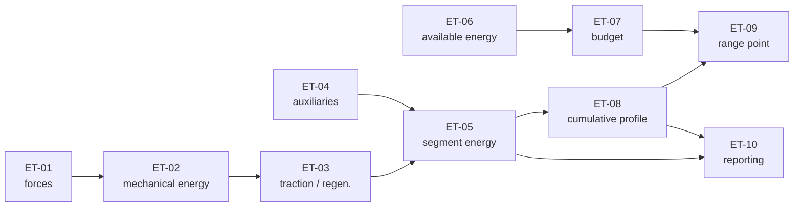

# SPEC-NRG-001 — Estimating the range over a route

| | |
|---|---|
| **Identifier** | SPEC-NRG-001 — specifies `FN-001` |
| **Version** | 2.0.2 |
| **Status** | Accepted |
| **Maturity level** | **4 — full specification** |
| **Business author** | *(role: Energy models manager, R&D Energy)* |
| **Business approver** | *(role: R&D Energy management)* |
| **Technical co-author** | *(role: Embedded architect)* |
| **Effective date** | 2026-04-01 |
| **Reference glossary** | [Domain glossary](2-GLOSSAIRE.md) v2.0.0 |
| **Parameter set** | Method repository v2026.2 |

> The central function of the running example *[The range of an electric
> vehicle](README.md)*. The glossary used here is the domain one:
> **[2-GLOSSAIRE.md](2-GLOSSAIRE.md)**.

---

## 1. Purpose and context

Answer the driver's question: **"how far can I go on this route?"**

The function produces the energy consumed segment by segment, the total energy, and the
**range point** — the distance at which the safety reserve is reached.

It is called in two very different situations (§11): **on board**, every ten seconds while
driving, and **on the ground**, before departure, to prepare a charging plan. Both must
give the same result on the same inputs.

## 2. Scope

**In scope:** the energy model, regeneration, auxiliaries, the effect of temperature on the
available energy, the safety reserve, the range point.

**Out of scope:**
- Computing the itinerary: the route is supplied, already cut into segments.
- Estimating the practicable speed (`FN-003`) and the auxiliary power (`FN-008`): these are
  inputs.
- Charging planning (`FN-004`).
- Rounding and presenting the range on the dashboard (`FN-011`).
- Battery ageing: the nominal capacity is an input, assumed up to date.

## 3. Model and assumptions

The vehicle is treated as a **point mass in a quasi-static regime**: on each segment the
speed is constant, so the acceleration is zero and the forces balance.

| # | Assumption | Consequence if violated |
|---|---|---|
| H-1 | Constant speed on a segment | Underestimation in city driving, where accelerations dominate |
| H-2 | No wind | A 20 km/h headwind at 110 km/h raises the drag by about 40 % |
| H-3 | Constant mass over the route | Negligible for an electric vehicle, which does not get lighter as it drives |
| H-4 | Constant air density | A gap of around 10 % between sea level and 1 000 m of altitude |
| H-5 | Constant efficiencies, independent of torque and speed | Optimistic at very low speed and under heavy load |

> These assumptions are **owned, not hidden**. That is what makes it possible, later, to
> explain a gap between the forecast and reality without hunting for a defect in the
> program (§8.2).

## 4. Inputs

```
request :
    route : ordered list of at least 1 Segment
    vehicle :
        kerb_mass               : Mass(kg, > 0, 1 decimal)
        payload_mass            : Mass(kg, ≥ 0, 1 decimal)
        drag_area               : Area(m², > 0, 3 decimals)   — the product Cd × A
        rolling_coefficient     : Dimensionless(> 0, 4 decimals)
        traction_efficiency     : Fraction(0.000 .. 1.000, 3 decimals)
        regeneration_efficiency : Fraction(0.000 .. 1.000, 3 decimals)
        nominal_capacity        : Energy(kWh, > 0, 2 decimals)
    state :
        state_of_charge         : Fraction(0.000 .. 1.000, 3 decimals)
        battery_temperature     : Temperature(°C, 1 decimal)
        auxiliary_power         : Power(W, ≥ 0, 1 decimal)    — produced by FN-008
    safety_reserve              : Energy(kWh, ≥ 0, 2 decimals) — produced by FN-010

Segment :
    distance          : Distance(km, > 0, 3 decimals)
    practicable_speed : Speed(km/h, > 0, 1 decimal)           — produced by FN-003
    gradient          : Percentage(%, signed, 2 decimals)     — positive uphill
```

**Preconditions:**
- The route contains at least one segment.
- Both efficiencies are strictly between 0 and 1.
- `safety_reserve` is lower than the available energy computed in `RG-060`.

## 5. Outputs

```
result :
    total_energy           : Energy(kWh, 4 decimals)    — may be negative on a downhill route
    average_consumption    : Energy(kWh/100 km, 3 decimals)
    available_energy       : Energy(kWh, 4 decimals)
    usable_budget          : Energy(kWh, 4 decimals)
    temperature_factor     : Fraction(3 decimals)
    range_point            : Distance(km, 3 decimals)   — absent if never reached
    range_point_reached    : Boolean
    energy_left_on_arrival : Energy(kWh, 4 decimals)    — present only if range_point_reached is false
    profile                : list of SegmentProfile

SegmentProfile :
    index                  : Integer(≥ 1)
    traction_energy        : Energy(kWh, 4 decimals)    — negative under regeneration
    auxiliary_energy       : Energy(kWh, 4 decimals)
    segment_energy         : Energy(kWh, 4 decimals)
    cumulative_energy      : Energy(kWh, 4 decimals)
    duration               : Duration(s, 1 decimal)
```

> The `profile` is a **first-class output**, not a debugging trace. It is required by the
> explainability constraint (§11): when a driver disputes an estimate, we must be able to
> show which segment consumed what.

## 6. Parameters

| Id | Name | Value | Unit | Who may change it | Approval route | Frequency | Effective date |
|---|---|---|---|---|---|---|---|
| <a id="p-01"></a>`P-01` | Acceleration of gravity | 9.81 | m·s⁻² | *physical constant, not modifiable* | — | never | 2026-04-01 |
| <a id="p-02"></a>`P-02` | Reference air density | 1.225 | kg·m⁻³ | R&D Energy | R&D management approval | rare | 2026-04-01 |
| <a id="p-03"></a>`P-03` | Temperature factor — scale | see `RG-060` | — | R&D Battery | Models committee | 1 to 2 times a year | 2026-04-01 |
| <a id="p-04"></a>`P-04` | Temperature factor used when the measurement is unavailable | 0.700 | — | R&D Battery | Models committee | rare | 2026-04-01 |

> `P-01` is a physical constant. It appears in the table **precisely so that nobody takes
> it for an adjustable value**, and it is marked not modifiable.
>
> `P-02`, by contrast, is **not** a constant: it is a chosen reference value (dry air,
> 15 °C, sea level). It belongs to R&D, and it will change the day altitude is taken into
> account (`Q-02`).

## 7. Rules

### 7.1 The processing chain

The calculation reads as ten boxes in sequence. The first six apply **to each segment**,
the last four **to the whole route**.

| Step | Consumes | Produces | Rules |
|---|---|---|---|
| `ET-01` Force balance | `distance`, `practicable_speed`, `gradient`, `kerb_mass`, `payload_mass`, `drag_area`, `rolling_coefficient` | `total_force` | `RG-010` |
| `ET-02` Mechanical energy | `total_force`, `distance` | `mechanical_energy` | `RG-020` |
| `ET-03` Traction and regeneration | `mechanical_energy`, `traction_efficiency`, `regeneration_efficiency` | `traction_energy` | `RG-030` |
| `ET-04` Auxiliaries | `distance`, `practicable_speed`, `auxiliary_power` | `duration`, `auxiliary_energy` | `RG-040` |
| `ET-05` Segment energy | `traction_energy`, `auxiliary_energy` | `segment_energy` | `RG-050` |
| `ET-06` Available energy | `nominal_capacity`, `state_of_charge`, `battery_temperature` | `temperature_factor`, `available_energy` | `RG-060` |
| `ET-07` Usable budget | `available_energy`, `safety_reserve` | `usable_budget` | `RG-070` |
| `ET-08` Cumulative profile | `segment_energy` | `index`, `cumulative_energy` | `RG-080` |
| `ET-09` Range point | `cumulative_energy`, `usable_budget`, `distance` | `range_point`, `range_point_reached`, `energy_left_on_arrival` | `RG-090` |
| `ET-10` Reporting | `segment_energy`, `cumulative_energy`, `duration` | `total_energy`, `average_consumption`, `profile` | `RG-100` |

### A higher-level view

Ten boxes is already too many for a conversation. They group:

| Group | Steps | Role |
|---|---|---|
| `GR-1` Segment consumption | `ET-01` `ET-02` `ET-03` `ET-04` `ET-05` | what a segment costs |
| `GR-2` Energy capital | `ET-06` `ET-07` | what is available |
| `GR-3` Route summary | `ET-08` `ET-09` `ET-10` | where we stop, and what is reported |

A group is a **view**, not a function: it adds no rule and imposes no split of the code.
What it consumes and produces towards the outside is **derived** from its steps — the
quantities that only serve inside the group disappear from the view, and that is the whole
point: `drag_force` and `mechanical_energy` have no business appearing in an architecture
discussion.

```bash
java outils/Verifier.java --chaine exemples/fil-rouge/5-SPEC-NRG-001.en.md
```

produces the "who creates / who uses" table for each quantity, runs checks `C-35` and
`C-36`, and generates the grouped view.

### Detailed view



> **What the chain allows, and what the rules do not show.** `ET-06` and `ET-07` consume
> nothing that `ET-01` to `ET-05` produce: the budget can therefore be computed **before,
> after or during** the pass over the segments, or even once for the whole route instead of
> once per segment. It is a real implementation latitude, and it is **demonstrated** here
> rather than assumed.

### 7.2 Internal quantities

Intermediate results visible **only inside the body of this function**. They appear neither
in the contract, nor in the data catalogue, nor in the inter-step chain — but they are
described with the same rigour.

```
total_mass           : Float(kg, 6 significant digits, > 0)
v                    : Float(m·s⁻¹, 6 significant digits, > 0)
alpha                : Float(rad, 6 significant digits, −0.30 .. 0.30)
d                    : Float(m, 6 significant digits, > 0)
drag_force           : Float(N, 6 significant digits, ≥ 0)
rolling_force        : Float(N, 6 significant digits, ≥ 0)
gradient_force       : Float(N, 6 significant digits)          — signed
mechanical_energy    : Float(J, 6 significant digits)          — signed
```

> `gradient_force` and `mechanical_energy` are **signed**, and it is that sign that carries
> the whole of regeneration (`RG-030`). A range carelessly declared `≥ 0` would make the
> model incapable of representing a descent — the kind of error you only find by declaring
> the internal quantities.

### RG-010 — Force balance on a segment

```
LET total_mass = kerb_mass + payload_mass                               (kg)
LET v       = practicable_speed ÷ 3.6                                   (m·s⁻¹)
LET alpha   = arctangent( gradient ÷ 100 )                              (rad)

    drag_force     = ½ × P-02 × drag_area × v²                          (N)
    rolling_force  = rolling_coefficient × total_mass × P-01 × cosine(alpha)   (N)
    gradient_force = total_mass × P-01 × sine(alpha)                    (N)

    total_force = drag_force + rolling_force + gradient_force           (N)
```

`gradient_force` is **signed**: negative on a descent. That sign is what makes the model
capable of representing regeneration, and it is what makes `RG-030` a non-linear rule.

> **The unit trap.** `practicable_speed` is in km/h, `v` in m/s. The factor 3.6 is written
> explicitly in the rule, and the test set carries the speed in both units (`CT-01`). A
> km/h ↔ m/s confusion produces an error of a factor of 13 on the drag — big enough to be
> found at once, which is a piece of luck.

### RG-020 — Mechanical energy of the segment

```
LET d = distance × 1000                                                 (m)

    mechanical_energy = total_force × d                                 (J)
```

### RG-030 — Traction and regeneration

```
IF mechanical_energy > 0 THEN
    traction_energy = mechanical_energy ÷ traction_efficiency           (J, positive)
ELSE
    traction_energy = mechanical_energy × regeneration_efficiency       (J, negative)
END IF
```

> **This is the only non-linearity of the model, and it is essential.** Under traction the
> losses *increase* the energy drawn from the battery: we divide by the efficiency. Under
> regeneration the losses *decrease* the energy returned: we multiply. Writing a single
> formula for both cases — the classic mistake — gives a vehicle that recovers 111 % of the
> energy of a descent, that is, perpetual motion.

### RG-040 — Auxiliaries

```
LET duration = d ÷ v                                                    (s)

    auxiliary_energy = auxiliary_power × duration                       (J)
```

Auxiliaries consume **per unit of time**, not per unit of distance. Driving more slowly
therefore increases their share — see the note on `INV-05`, which draws a counter-intuitive
consequence from it.

### RG-050 — Energy of a segment

```
    segment_energy = ( traction_energy + auxiliary_energy ) ÷ 3 600 000 (kWh)
```

**No rounding is applied here**, nor at any intermediate step. Rounding happens only when
the outputs are produced (`RG-100`).

### RG-060 — Available energy and temperature factor

The scale `P-03` applies in **steps**, upper bounds included:

| Battery temperature | Factor |
|---|---|
| `T ≤ −10.0 °C` | 0.700 |
| `−10.0 °C < T ≤ 0.0 °C` | 0.800 |
| `0.0 °C < T ≤ 10.0 °C` | 0.900 |
| `10.0 °C < T ≤ 30.0 °C` | 1.000 |
| `T > 30.0 °C` | 0.950 |

```
    available_energy = nominal_capacity × state_of_charge × temperature_factor
```

**No interpolation between steps.** A variation of a tenth of a degree can therefore tip
the result from one step to the next — this is owned, and it is the subject of `Q-01`.

> **Why steps rather than a curve.** The scale comes from test campaigns run at a few
> temperatures. Interpolating would give an illusion of precision the measurements do not
> carry. The business preferred a visible step to an invented continuity.

If the battery temperature is unavailable, `P-04` = 0.700 is used, **the least favourable
factor of the scale** — see §11, degraded mode.

### RG-070 — Usable budget

```
    usable_budget = available_energy − safety_reserve
```

### RG-080 — Cumulative profile

```
index = rank of the segment in the route, from 1

    cumulative_energy(0) = 0
    cumulative_energy(i) = cumulative_energy(i − 1) + segment_energy(i)

The accumulation is indexed, never overwritten: cumulative_energy(i) names one value
and one only, for ever.
```

The cumulative energy is **not monotonic**: a steep downhill segment makes it decrease. Any
implementation that assumes an increasing sequence — to do a binary search, for example —
is wrong.

### RG-090 — Range point

```
The RANGE POINT is the distance, from the start, of the FIRST point where the
cumulative energy reaches the usable budget.

The order of the route acts as the tie-break: the segments are totally ordered, so
"the first" names one segment and one only. No tie is possible.

The segments are traversed in order. For a given segment, the energy already consumed
on entering it is that of all the segments preceding it:

    LET cumulative_energy_before = SUM OF segment_energy OVER segments
                                   preceding the current segment

For the first segment such that
    cumulative_energy_before + segment_energy ≥ usable_budget
   AND segment_energy > 0 :

    LET fraction = ( usable_budget − cumulative_energy_before ) ÷ segment_energy
    range_point = distance accumulated before this segment + fraction × distance of the segment
    range_point_reached = true

IF no segment satisfies this condition THEN
    range_point_reached = false
    range_point is not produced
    energy_left_on_arrival = usable_budget − total_energy
ELSE
    range_point_reached = true
    energy_left_on_arrival is not produced
END IF
```

Two points the wording settles explicitly:

- **"the first"**, and not "the one where we end up below". A later descent can bring the
  cumulative energy back under the budget; **it does not give back the range already
  consumed**. The driver went into the reserve, and that fact stands.
- **`AND segment_energy > 0`**: on a regenerating segment the cumulative energy decreases;
  it cannot contain the crossing point, and interpolating there would be absurd.

The interpolation is **affine inside the segment**, which is consistent with assumption
`H-1` of constant speed and gradient: over a segment, energy is consumed uniformly with
distance.

### RG-100 — Rounding and rounding directions

| Quantity | Decimals | Direction |
|---|---|---|
| Energies (`kWh`) | 4 | to nearest |
| Average consumption (`kWh/100 km`) | 3 | to nearest |
| Durations (`s`) | 1 | to nearest |
| **`range_point` (`km`)** | 3 | **downwards, always** |

> **The range point rounds downwards, never to nearest.** This is not a computing
> convention: it is a safety rule. An optimistic estimate of a few metres has no
> consequence on a spreadsheet, and has one on a motorway.
>
> This rule is the best example in the whole repository of a decision that **looks
> technical and is not**. It belongs to Customer experience, it is written down, it is
> dated, and it will never be "optimised" by a developer in a hurry.

## 8. Invariants and numerical acceptance criteria

### 8.1 Invariants

| Id | Property |
|---|---|
| <a id="inv-01"></a>`INV-01` | On a segment with a positive or zero gradient, `segment_energy > 0` |
| <a id="inv-02"></a>`INV-02` | **Additivity**: splitting a segment into two halves of the same speed and gradient gives exactly the same energy as the whole segment |
| <a id="inv-03"></a>`INV-03` | **Homogeneity**: at equal speed and gradient, doubling the distance doubles `traction_energy` and `auxiliary_energy` |
| <a id="inv-04"></a>`INV-04` | **Gradient symmetry**: a round trip over the same segment consumes strictly more than twice the same segment on the flat — regeneration never compensates the climb |
| <a id="inv-05"></a>`INV-05` | **Monotonicity in speed, above the minimum-consumption speed**: see the note below |
| <a id="inv-06"></a>`INV-06` | `range_point`, if it exists, lies between 0 and the total length of the route |
| <a id="inv-07"></a>`INV-07` | The calculation is deterministic: same inputs, same outputs, profile included |
| <a id="inv-08"></a>`INV-08` | The calculation is **pure**: no successive call depends on a previous one |

> **The subtlety of `INV-05`, and why it is written down.** One spontaneously believes that
> driving more slowly always consumes less. That is false: drag decreases with speed, but
> auxiliaries consume *per unit of time*, so their share per kilometre grows as you slow
> down. There is a **minimum-consumption speed**, around **30 km/h** with the parameters of
> the test set — below it, slowing down costs more. `CT-06` checks it.
>
> An invariant saying "consumption grows with speed" written without that caveat would be
> **false**, and its property test would fail on perfectly legitimate inputs. It is exactly
> the kind of error a business peer review catches and a technical review lets through.

### 8.2 Three levels of exactness

| | **Reproducibility** | **Numerical accuracy** | **Model validity** |
|---|---|---|---|
| Question | Do the two implementations, embedded and server, give the same number? | Is the number the true value of the formulas of §7? | Does the model describe real consumption? |
| Assessed against | This specification | The hand calculation of §10 | Measurements on track and on the road |
| Tolerance | **10⁻⁹ relative**, strict equality on the indicators and the number of segments | **10⁻⁹ relative** — the formulas are closed, there is no approximate method | **± 8 %** on the total energy, over the approved reference route |
| Exceeding it means | An implementation is not conforming, **or the specification is ambiguous** | An error in coding the formulas | Assumptions `H-1` to `H-5` have left their domain — **not a defect of the program** |
| Checked | On every delivery, on both implementations | On every delivery | Twice a year, with R&D |

> The ± 8 % of the third column is the real uncertainty of the product. A driver who
> observes a 6 % gap has not found a bug: they have met `H-2`, the wind. **Without that
> column, the team spends its time hunting for defects in correct code.**

## 9. Business error cases

| Code | Condition | Consequence | Message |
|---|---|---|---|
| <a id="e-trajet-001"></a>`E-TRAJET-001` | The route contains no segment | No result | "No route to analyse." |
| <a id="e-trajet-002"></a>`E-TRAJET-002` | A segment has a zero or negative distance or speed | No result | "The route contains an invalid segment." |
| <a id="e-vehic-001"></a>`E-VEHIC-001` | An efficiency is outside the interval `]0 ; 1[` | No result | "The characteristics of the vehicle are invalid." |
| <a id="e-reserve-001"></a>`E-RESERVE-001` | The safety reserve is greater than or equal to the available energy | No result | "The available energy does not allow driving." |

## 10. Test set

### Provenance and validation of the expected results

| | |
|---|---|
| **Provenance** | **Analytical solution.** The formulas of §7 are closed: no approximate method is involved |
| **How they were examined** | Recomputed by hand, step by step, on a scientific calculator; the rich case `CT-01` was redone by a second reader |
| **Approved by** | *(role: R&D Energy management)* |
| **On** | 2026-02-24 |
| **For version** | 1.0.0, carried over in 2.0.0 and 2.0.1 |

*These results are **reference data**: they qualify the code and serve as the
non-regression baseline. They change only through a dated business re-approval
([CADRE §5](../../CADRE.md)).*

**Building the oracle.** The formulas of §7 are **closed**: no approximate method is
involved. The values below are therefore computable by hand, step by step, and were
produced by no implementation. A scientific calculator is enough to redo them.

**Reference vehicle**, used in every case:

| Quantity | Value |
|---|---|
| Kerb mass + payload | 1 800.0 kg |
| Frontal area × Cd | 0.640 m² |
| Rolling coefficient | 0.0100 |
| Traction efficiency | 0.900 |
| Regeneration efficiency | 0.600 |
| Nominal capacity | 60.00 kWh |
| Auxiliary power | 500.0 W |

**Reference route**, 4 segments, 125.0 km:

| # | Distance | Practicable speed | Gradient |
|---|---|---|---|
| 1 | 100.000 km | 110.0 km/h | 0.00 % |
| 2 | 10.000 km | 90.0 km/h | +3.00 % |
| 3 | 10.000 km | 90.0 km/h | −3.00 % |
| 4 | 5.000 km | 50.0 km/h | 0.00 % |

### At a glance

| Id | What it exercises | Expected result |
|---|---|---|
| `CT-01` | The force balance and the energy, segment by segment | **20.5060 kWh** over 125 km |
| `CT-02` | Regeneration on a descent (`RG-030`) | segment 3: **−0.1244 kWh** |
| `CT-03` | The range point with interpolation inside segment 2 | **106.017 km** |
| `CT-04` | The effect of temperature (`RG-060`) on the same route | **82.555 km** |
| `CT-05` | Range never reached | `range_point_reached = false`, **1.4940 kWh** left |
| `CT-06` | The minimum-consumption speed (`INV-05`) | minimum at **≈ 29.9 km/h** |
| `CT-07` | Temperature unavailable → least favourable factor | factor **0.700** |
| `CT-08` | Empty route | error `E-TRAJET-001` |

### CT-01 — Full balance, segment by segment

`state_of_charge = 1.000`, `battery_temperature = 20.0 °C`.

**Segment 1** — 100.000 km at 110.0 km/h, zero gradient. Full detail:

| Step | Calculation | Result |
|---|---|---|
| `v` | `110.0 ÷ 3.6` | 30.5556 m·s⁻¹ |
| `drag_force` | `0.5 × 1.225 × 0.640 × 30.5556²` | 365.99 N |
| `rolling_force` | `0.0100 × 1800 × 9.81 × cos(0)` | 176.58 N |
| `gradient_force` | `1800 × 9.81 × sin(0)` | 0.00 N |
| `total_force` | | **542.57 N** |
| `mechanical_energy` | `542.57 × 100 000` | 54.2568 MJ |
| `traction_energy` | `54.2568 ÷ 0.900` | 60.2853 MJ → **16.7459 kWh** |
| `duration` | `100 000 ÷ 30.5556` | 3 272.7 s |
| `auxiliary_energy` | `500.0 × 3 272.7` | 1.6364 MJ → **0.4545 kWh** |
| **`segment_energy`** | | **17.2005 kWh** |

**The four segments:**

| # | `drag_force` | `rolling_force` | `gradient_force` | `total_force` | `traction_energy` | `auxiliary_energy` | **`segment_energy`** | `cumulative_energy` |
|---|---|---|---|---|---|---|---|---|
| 1 | 365.99 | 176.58 | 0.00 | 542.57 | 16.7459 | 0.4545 | **17.2005** | 17.2005 |
| 2 | 245.00 | 176.50 | +529.50 | 951.00 | 2.9352 | 0.0556 | **2.9907** | 20.1912 |
| 3 | 245.00 | 176.50 | −529.50 | −108.00 | −0.1800 | 0.0556 | **−0.1244** | 20.0668 |
| 4 | 75.62 | 176.58 | 0.00 | 252.20 | 0.3892 | 0.0500 | **0.4392** | 20.5060 |

- **`total_energy` = 20.5060 kWh**
- **`average_consumption` = 16.405 kWh/100 km**

> Note the `cumulative_energy` column: it **decreases** between segments 2 and 3. That is
> `RG-080` at work, and it is what forbids any binary search.

### CT-02 — Regeneration

Segment 3 on its own — 10.000 km at 90.0 km/h, gradient −3.00 %:

| Step | Calculation | Result |
|---|---|---|
| `alpha` | `arctan(−0.03)` | −0.029991 rad |
| `gradient_force` | `1800 × 9.81 × sin(−0.029991)` | −529.50 N |
| `total_force` | `245.00 + 176.50 − 529.50` | **−108.00 N** |
| `mechanical_energy` | `−108.00 × 10 000` | −1.0800 MJ |
| `traction_energy` | `mechanical_energy ≤ 0` → **we multiply**: `−1.0800 × 0.600` | −0.6480 MJ → **−0.1800 kWh** |
| `auxiliary_energy` | `500.0 × 400.0` | **+0.0556 kWh** |
| **`segment_energy`** | | **−0.1244 kWh** |

> **The error detector.** An implementation dividing by the efficiency in both branches
> would give `−1.0800 ÷ 0.600 = −1.8000 MJ` here, that is **−0.5000 kWh**: the vehicle
> would recover nearly three times what the descent gives it. This single test case is
> enough to catch it.

### CT-03 — Range point, interpolation inside segment 2

`state_of_charge = 0.400`, `battery_temperature = 20.0 °C`, `safety_reserve = 5.00 kWh`.

| Step | Calculation | Result |
|---|---|---|
| `temperature_factor` | `10.0 < 20.0 ≤ 30.0` | 1.000 |
| `available_energy` | `60.00 × 0.400 × 1.000` | 24.0000 kWh |
| `usable_budget` | `24.0000 − 5.00` | **19.0000 kWh** |
| First segment crossed | `17.2005 < 19.0000 ≤ 20.1912` | **segment 2** |
| `fraction` | `(19.0000 − 17.2005) ÷ 2.9907` = `1.7995 ÷ 2.9907` | 0.601702 |
| **`range_point`** | `100.000 + 0.601702 × 10.000` | **106.017 km** |

*(rounded downwards to 3 decimals, `RG-100` — the exact value is 106.01702…)*

### CT-04 — The same route at −5 °C

Same inputs as `CT-03`, but `battery_temperature = −5.0 °C`.

| Step | Calculation | Result |
|---|---|---|
| `temperature_factor` | `−10.0 < −5.0 ≤ 0.0` | **0.800** |
| `available_energy` | `60.00 × 0.400 × 0.800` | 19.2000 kWh |
| `usable_budget` | `19.2000 − 5.00` | **14.2000 kWh** |
| First segment crossed | `14.2000 ≤ 17.2005` | **segment 1** |
| `fraction` | `14.2000 ÷ 17.2005` | 0.825559 |
| **`range_point`** | `0.000 + 0.825559 × 100.000` | **82.555 km** |

> **23.5 km lost for 25 degrees less**, with nothing else changing. Every electric vehicle
> driver knows this effect; few know that it bears only on the *available* energy, not on
> the consumption. The specification says so, and the test case puts a number on it.

### CT-05 — Range never reached

Same inputs as `CT-03`, but `state_of_charge = 0.450`.

| Step | Calculation | Result |
|---|---|---|
| `available_energy` | `60.00 × 0.450 × 1.000` | 27.0000 kWh |
| `usable_budget` | `27.0000 − 5.00` | 22.0000 kWh |
| Comparison | `20.5060 < 22.0000` over the whole route | never crossed |
| `range_point_reached` | | **false** |
| `range_point` | | **not produced** |
| `energy_left_on_arrival` | `22.0000 − 20.5060` | **1.4940 kWh** |

### CT-06 — The minimum-consumption speed

A flat segment of 100 km, varying the practicable speed alone:

| Speed | Consumption |
|---|---|
| 10.0 km/h | 10.543 kWh/100 km |
| 20.0 km/h | 8.323 kWh/100 km |
| **29.9 km/h** | **7.957 kWh/100 km** ← minimum |
| 40.0 km/h | 8.194 kWh/100 km |
| 60.0 km/h | 9.644 kWh/100 km |
| 110.0 km/h | 17.200 kWh/100 km |

The speed of the minimum is `∛( traction_efficiency × auxiliary_power ÷
( P-02 × drag_area ) )` = **8.3106 m·s⁻¹ = 29.92 km/h**.

> This case checks `INV-05` **and its caveat**. A property test claiming "consumption grows
> with speed" would fail between 10 and 30 km/h — on perfectly valid inputs. Better to find
> that out here than in a bug report.

### CT-07 — Temperature unavailable

`battery_temperature` absent → `temperature_factor = P-04 = 0.700`, **the least favourable
of the scale**. With `state_of_charge = 0.400`: `available_energy = 16.8000 kWh`,
`usable_budget = 11.8000 kWh`, `range_point = 68.602 km`.

> The direction of the fallback is an explicit business decision: **in the absence of
> information, always choose the assumption unfavourable to the vehicle.** A fallback to
> 1.000 would have been just as "reasonable" technically, and would have left drivers
> stranded.

### CT-08 — Empty route

→ **error `E-TRAJET-001`**, no result.

### Coverage table

| Rule | Covered by | | Rule | Covered by |
|---|---|---|---|---|
| `RG-010` | CT-01, CT-02, CT-06 | | `RG-070` | CT-03, CT-04, CT-05 |
| `RG-020` | CT-01 | | `RG-080` | CT-01 |
| `RG-030` | **CT-02** (both branches) | | `RG-090` | CT-03, CT-04, CT-05 |
| `RG-040` | CT-01, CT-06 | | `RG-100` | CT-03, CT-04 |
| `RG-050` | all | | `INV-02` to `INV-05` | property tests + CT-06 |
| `RG-060` | CT-03, CT-04, CT-07 | | `E-VEHIC-001`, `E-RESERVE-001` | *not covered — `Q-04`* |

## 11. Constraints and requirements

### 11.1 Business constraints

Two uses, **one specification** — and two implementations that must agree to the billionth.

| Dimension | **Embedded** (vehicle computer) | **Server** (route preparation) |
|---|---|---|
| **Volume** | 1 calculation every 10 s while driving; routes up to **3 000 segments** | 4 million routes a day, up to 3 000 segments |
| **Call mode** | Periodic, **on board, with no network** | On demand, synchronous |
| **Latency** | **Under 20 ms**, on an automotive computer — not a server | under 300 ms at the 95th percentile |
| **Energy and memory** | **Hard constraint**: a few hundred kilobytes, no dynamic allocation during the calculation | none |
| **Exactness** | See §8.2. Reproducibility **10⁻⁹** between the two implementations | the same |
| **Determinism** | Strict (`INV-07`), profile included | the same |
| **Stability** | **Two successive calculations 10 s apart, on a vehicle that has barely moved, must not produce a range point varying by more than 2 km.** A display that oscillates is judged faulty by the driver, even when it is right | not applicable |
| **Replayability** | **5 years.** Every vehicle immobilised for lack of energy is analysed: inputs, parameters and specification version must allow the calculation to be replayed identically | the same |
| **Auditability** | The complete `profile` is logged on board for the last 100 kilometres | kept with the route |
| **Explainability** | The driver must be able to see which segment consumes what | the same |
| **Criticality and degraded mode** | **Temperature unavailable → least favourable factor `P-04`, and the driver is told.** Practicable speed unavailable on a segment → the legal limit is used. **Never an optimistic fallback** | the same |
| **Confidentiality** | No personal data in the calculation. The route, however, is personal data: it does not leave the vehicle without consent — which is why the embedded variant exists at all | the route is pseudonymised |
| **Compliance** | The range figures communicated to the driver must not be presented as approved homologation figures (see the homonym *range* in the glossary) | the same |
| **Change frequency** | `P-02` to `P-04`: 1 to 2 times a year. Rules: rare, but every change to the model goes through this document | the same |
| **Who changes it** | R&D must be able to revise the temperature scale **without updating the computer** — scale downloaded, versioned, dated | the same |
| **Lifetime** | **15 years** — the lifetime of a vehicle | 10 years |

### 11.2 Implementation requirements

Received from Safety management, Vehicle architecture and Data protection. The business did
not write them: it carries them, because this is the document development will read.

| Id | Requirement | Source | Who approves | Verification |
|---|---|---|---|---|
| <a id="ex-01"></a>`EX-01` | The computer software is written in the **MISRA C:2012** subset, mandatory and required categories | Software safety policy `DIR-SUR-004` | Safety management | **Blocking** static analysis in continuous integration |
| <a id="ex-02"></a>`EX-02` | **No dynamic memory allocation** after the initialisation phase | `DIR-SUR-004` §4.2 | Safety management | Static analysis + design review |
| <a id="ex-03"></a>`EX-03` | The **worst-case** execution time is bounded, measured on target, and documented | `DIR-SUR-004` §6 | Safety management | Bench measurement, on every delivery |
| <a id="ex-04"></a>`EX-04` | The function runs in the **non-critical partition** of the computer; it can neither read nor write in the control partition | Safety architecture `ARC-VEH-11` | Vehicle architecture | Architecture review + partitioning test |
| <a id="ex-05"></a>`EX-05` | The function has at most **512 KB of RAM** and assumes no garbage collector | `ARC-VEH-11` §3 | Vehicle architecture | Footprint measurement on every delivery |
| <a id="ex-06"></a>`EX-06` | The **route is category C2 personal data**: it does not leave the vehicle without explicit consent, and is never logged in non-aggregated form | Data protection policy `POL-DCP-2` | Data protection | Annual compliance review + code review on the logging points |
| <a id="ex-07"></a>`EX-07` | The data of the non-critical partition and that of the control partition are **stored separately**, with no channel other than the declared interface | `ARC-VEH-11` §5 | Vehicle architecture | Partitioning test |
| <a id="ex-08"></a>`EX-08` | The server service uses a language from the **approved technical list** `LTA-2026` | Architecture committee | IT architecture | Architecture review before going live |
| <a id="ex-09"></a>`EX-09` | The **test coverage** of the embedded code reaches 100 % of branches on the calculation functions | `DIR-SUR-004` §7 | Safety management | Coverage report, blocking |

> **A conflict to arbitrate.** `EX-08` points to an approved list that contains mostly
> garbage-collected environments, while the business latency constraint on the server side
> (300 ms at the 95th percentile) remains achievable — but the **reproducibility to the
> billionth** between the two implementations demands numerical behaviour identical to that
> of the embedded C. The point is open as `Q-06`.

## 12. Open questions

| Id | Question | Decider | Due | Status |
|---|---|---|---|---|
| <a id="q-01"></a>`Q-01` | The temperature scale works in steps (`RG-060`). A tenth of a degree can move the range by several kilometres, which may clash with the **stability** constraint of §11. Should it be interpolated, or should hysteresis be introduced? | R&D Battery | 2026-06-30 | Open |
| <a id="q-02"></a>`Q-02` | The air density (`P-02`) is fixed. Should it be corrected for altitude, which the route knows? Estimated gain: 3 to 4 % in the mountains | R&D Energy | 2026-09-30 | Open |
| <a id="q-03"></a>`Q-03` | `H-2` assumes no wind. Weather forecasts are available on the server side, not on board. Introducing wind would create **two different results** for the two uses — which §8.2 forbids today | R&D management | 2026-12-31 | Open |
| <a id="q-04"></a>`Q-04` | `E-VEHIC-001` and `E-RESERVE-001` are covered by no test case | Business author | 2026-05-31 | Open |
| <a id="q-06"></a>`Q-06` | `EX-08` imposes an approved technical list on the server side, while `EX-01` imposes MISRA C on board. Is the 10⁻⁹ reproducibility between the two implementations (§8.2) achievable with every language on the list, or must it be restricted for this function? | IT architecture **and** Safety management | 2026-07-31 | Open |
| <a id="q-05"></a>`Q-05` | *Settled on 2026-03-12:* does the range point round to nearest or downwards? → **downwards**, without exception (`RG-100`) | Customer experience | — | Closed |

## 13. History and change notices

| Version | Date | Change | Impact on results | Notice |
|---|---|---|---|---|
| 1.0.0 | 2026-02-24 | Initial version | — | — |
| **2.0.0** | 2026-03-12 | `RG-100`: the range point rounds downwards (`Q-05`) | **Yes** — up to 1 m, always in the cautious direction | `N-2.0.0` |
| 2.0.1 | 2026-03-20 | `RG-050` and `RG-090` revised: the term *average consumption* is replaced by an explicit statement of its basis, following the removal of the term from the glossary (v2.0.0) | None — an editorial clarification | — |
| 2.0.2 | 2026-08-21 | `RG-090`: `cumulative_energy_before` was used without ever having been defined (a ghost caught by `C-03`); the rule now introduces it explicitly | None — the wording makes explicit what was implicit | — |

### N-2.0.0 — The range point now rounds downwards

**Reason.** Three drivers stranded in six months, all within 500 m of a charging point the
display said was reachable. Analysis showed that rounding to nearest produced an
**optimistic** estimate in half the cases. A rounding of a few metres has no consequence on
a spreadsheet; it has one on a motorway. Decision `Q-05`, settled on 2026-03-12 by Customer
experience.

**Functions affected**

| Function | Nature of the impact |
|---|---|
| `FN-001` | **behaviour** — `range_point` may decrease by at most 1 m |
| `FN-011` | **behaviour** — the displayed range inherits the rounding direction |
| `FN-004` | **none** — re-examined: the charging plan is based on the energy budget, not on the rounded distance |
| `FN-007` | **none** — re-examined: the alert threshold is on the energy |

**Impacts on the contracts**

| Function | Element | Nature | Detail | Compatibility |
|---|---|---|---|---|
| `FN-001` | `range_point` | **modification** | the rounding direction goes from "to nearest" to "downwards"; type, unit and precision unchanged | compatible |

No addition, no removal. The contract is **unchanged in its form** — only the semantics of
the value tightens, in the cautious direction. This is the favourable case: the callers have
nothing to do.

**Consequences**

| | |
|---|---|
| **Replay** | not needed — the gap is bounded by 1 m and always goes in the direction of safety |
| **Effective date** | 2026-04-01, with version 2026.2 of the method repository |
| **Consumers to warn** | the `FN-011` teams (display) and the driver documentation |

---

## Annexe — A technical reading

> Added by the architect after acceptance.

| Constraint read in §11 | Technical decision it leads to |
|---|---|
| Reproducibility 10⁻⁹, no approximate method | **Binary double precision, and it is indispensable here** — not for the exactness of the business result, but because a tolerance of 10⁻⁹ between two implementations does not hold in single precision. A contrast with [SPEC-MAS-001](../mass-balance/spec/SPEC-MAS-001.en.md), where it was the exact conservation of mass that demanded an exact decimal: **three different requirements, three different numeric types** |
| < 20 ms, 3 000 segments, no dynamic allocation | **A single in-place pass, with no allocation**: the profile is written into a pre-allocated buffer. Libraries that allocate implicitly are forbidden. That is what rules out, on board, most garbage-collected environments |
| `RG-080`: non-monotonic accumulation | **A formal ban on binary search** over the profile, which would otherwise be the first optimisation reflex. The rule says so, `CT-01` proves it — without which the optimisation would be made and the bug shipped |
| `INV-08`: the calculation is pure | The function carries **no state**. The **stability** constraint is therefore satisfied by the caller, which compares against the previous plan (`FN-012`) — not by making this function depend on its past. That is what makes it testable and replayable |
| Two uses, the same closed formulas | **The same source code** compiled for both targets, and the **same test set** run on both sides in continuous integration. Reproducibility to the billionth is not a wish: it is a test that fails |
| Temperature scale revisable without updating the computer | The scale lives in a **signed, versioned and dated parameter file**, shipped separately from the program. `P-01`, a physical constant, is the only hard-coded value |
| Replayability of 5 years, immobilisation analysis | Inputs, parameters and specification version logged on board with the profile. A replay **never** re-reads the current parameters |
| ± 8 % of model validity (§8.2) | Three **separate** test campaigns: non-regression on every delivery, exactness of the formulas on every delivery, model validity twice a year with R&D. Without that separation, every gap reported by a driver would become a ticket |

**What the specification deliberately did not say**: the language, the representation of the
segments, the caching strategy, the format of the parameter file, the way the profile is
logged. None of that can betray a rule — and all of it will change at least once in the
fifteen years of a vehicle's life.

## Annexe — Identités

*Chaque objet porte un UUID attribué une fois et jamais modifié. L'identifiant lisible et le libellé sont des étiquettes : ils peuvent changer, l'identité non. Voir [CADRE.md §2.8](../../CADRE.md).*

| Identifiant | UUID | Nature | Libellé |
|---|---|---|---|
| `SPEC-NRG-001` | `9888723b-beee-4e1a-85ad-b631de8753be` | document | SPEC-NRG-001 — Estimating the range over a route |
| `RG-010` | `980c488b-daf2-4834-b00e-c8d45668671a` | règle | Force balance on a segment |
| `RG-020` | `aeb9bd4f-38b4-4a27-8c60-28fc5d8141e7` | règle | Mechanical energy of the segment |
| `RG-030` | `069a2362-2dfb-4a2b-9e2e-f25e55c33516` | règle | Traction and regeneration |
| `RG-040` | `947eb789-a60f-4267-8b78-dbca001441a8` | règle | Auxiliaries |
| `RG-050` | `0a2c8c35-e90b-4e9a-a67a-84796f979fc0` | règle | Energy of a segment |
| `RG-060` | `2eb8fe40-e628-4405-aa72-116729d70ba0` | règle | Available energy and temperature factor |
| `RG-070` | `6a56299f-1c41-47be-bfa9-02bedc1ac609` | règle | Usable budget |
| `RG-080` | `bebe83a6-bc21-4e69-9933-58259b8e74b1` | règle | Cumulative profile |
| `RG-090` | `6c28457c-2b40-43aa-9c83-a3ace089ccdc` | règle | Range point |
| `RG-100` | `ebf7bf69-d50b-4715-bfc6-03cf50323ef9` | règle | Rounding and rounding directions |
| `CT-01` | `263cbebd-9441-4b74-9c57-846a2f5a389b` | cas de test | Full balance, segment by segment |
| `CT-02` | `2cabdb36-4f9e-4af5-8a6e-812b673be478` | cas de test | Regeneration |
| `CT-03` | `45b15e7c-d7b2-4c2e-b929-f91928f6e003` | cas de test | Range point, interpolation inside segment 2 |
| `CT-04` | `d53a1d67-9713-4cac-ae1a-aeadd35ce458` | cas de test | The same route at −5 °C |
| `CT-05` | `0dccee30-3ba4-447f-871f-2f844c974226` | cas de test | Range never reached |
| `CT-06` | `6c3d7b34-250c-4744-809c-e4b8043d05da` | cas de test | The minimum-consumption speed |
| `CT-07` | `b6a9cb5c-3772-4221-bd2b-81426d0491aa` | cas de test | Temperature unavailable |
| `CT-08` | `c31484ce-4b11-467b-9cf5-8d3eaf5dd241` | cas de test | Empty route |
| `FN-001` | `43b0691e-1348-4088-99c5-86c584a90c42` | fonction | behaviour |
| `FN-011` | `f54e3523-e7d6-420e-ba89-c7ac8028e666` | fonction | behaviour |
| `FN-004` | `ed9194c2-f465-458b-a68a-5bc2461be15d` | fonction | none |
| `FN-007` | `56568916-bbd1-44d2-86fc-12416f98676c` | fonction | none |
| `P-01` | `6573a577-9067-4cd6-861d-b257b71803d5` | paramètre | Acceleration of gravity |
| `P-02` | `cce939a5-46cd-4eb3-a512-5c3f3de13dc7` | paramètre | Reference air density |
| `P-03` | `ea5e594b-7ea7-4cff-9304-bbb3e4f25f72` | paramètre | Temperature factor — scale |
| `P-04` | `4ea5c434-9869-4176-975d-1813cecfa836` | paramètre | Temperature factor used when the measurement is unavailable |
| `EX-01` | `f25aa050-8a85-4e55-b202-b31cb0a683b8` | exigence | The computer software is written in the **MISRA C:2012** subset, manda |
| `EX-02` | `d1f9aa40-7f4f-4ad1-a341-57f5064ff4f6` | exigence | No dynamic memory allocation after the initialisation phase |
| `EX-03` | `c4b092be-6904-473d-ab88-3132570724b1` | exigence | The **worst-case** execution time is bounded, measured on target, and |
| `EX-04` | `874a1ca9-d14a-43d5-9daf-865e9b8b7fc0` | exigence | The function runs in the **non-critical partition** of the computer; i |
| `EX-05` | `d2d7839d-11dd-4f4e-a4e6-1c0aa842c169` | exigence | The function has at most **512 KB of RAM** and assumes no garbage coll |
| `EX-06` | `d6310e36-7c2f-4ec2-9173-abc13fcc309b` | exigence | The **route is category C2 personal data**: it does not leave the vehi |
| `EX-07` | `fca54b2f-b68d-4a52-98d9-83f4f907b530` | exigence | The data of the non-critical partition and that of the control partiti |
| `EX-08` | `d34bba90-81e0-4566-a9b5-afcf17b81d19` | exigence | The server service uses a language from the approved technical list* |
| `EX-09` | `e607e38d-b669-4ace-ba48-3098e6763c09` | exigence | The **test coverage** of the embedded code reaches 100 % of branches o |
| `INV-01` | `5afa3fa9-13fd-455a-90f9-a7d6a105894e` | invariant | On a segment with a positive or zero gradient, `segment_energy > 0` |
| `INV-02` | `8cd75e36-1a32-4cbe-be56-1fa572e468ef` | invariant | Additivity: splitting a segment into two halves of the same speed and |
| `INV-03` | `e9dd2410-9fb4-485a-b8c6-b7966b7dc047` | invariant | Homogeneity: at equal speed and gradient, doubling the distance double |
| `INV-04` | `faf499ce-6b1c-4b8e-af2d-1396d49bc513` | invariant | Gradient symmetry: a round trip over the same segment consumes strictl |
| `INV-05` | `21267255-1108-4c13-adf6-5832b0069bde` | invariant | Monotonicity in speed, above the minimum-consumption speed: see the no |
| `INV-06` | `683ae5b4-21f5-4841-80c6-d1e5fa76fffa` | invariant | `range_point`, if it exists, lies between 0 and the total length of th |
| `INV-07` | `cabb4a7c-3cc6-4b7f-840b-fa14ee4d0f4a` | invariant | The calculation is deterministic: same inputs, same outputs, profile i |
| `INV-08` | `52d43b49-e236-4a5c-9835-ebe75ef1aecf` | invariant | The calculation is **pure**: no successive call depends on a previous |
| `E-TRAJET-001` | `13e307f4-1b7a-444c-8829-d186c50601e9` | cas d'erreur | The route contains no segment |
| `E-TRAJET-002` | `fe15e79b-a26e-4641-b826-8b0e35466f73` | cas d'erreur | A segment has a zero or negative distance or speed |
| `E-VEHIC-001` | `3edc5a91-74d0-4ebc-aba7-6eb8e7e3352e` | cas d'erreur | An efficiency is outside the interval `]0 ; 1[` |
| `E-RESERVE-001` | `e8eccfd9-d2cf-4434-9773-91abb263881f` | cas d'erreur | The safety reserve is greater than or equal to the available energy |
| `Q-01` | `41dea1ff-81d5-42cc-a782-0da8ba4473eb` | question | The temperature scale works in steps (`RG-060`). A tenth of a degree c |
| `Q-02` | `3cc439b5-c892-4f1b-9b73-404b674cf47f` | question | The air density (`P-02`) is fixed. Should it be corrected for altitude |
| `Q-03` | `e00a269d-7baf-4009-8412-13e4ccb848e8` | question | `H-2` assumes no wind. Weather forecasts are available on the server s |
| `Q-04` | `9e5fa8d2-ece3-4239-a3f5-6e034f7cbcfd` | question | `E-VEHIC-001` and `E-RESERVE-001` are covered by no test case |
| `Q-06` | `1ffdcc6b-2965-4ac9-a517-25affafc0b44` | question | `EX-08` imposes an approved technical list on the server side, while |
| `Q-05` | `0c21b3f5-6dd0-46d4-bc12-cd24d35a5f10` | question | Settled on 2026-03-12:* does the range point round to nearest or downw |
