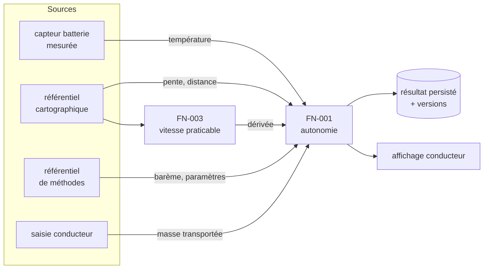

# Guide 3 — Le cheminement des données

*À faire après le glossaire, avant d'écrire les règles. Sortie attendue : le catalogue des
données du périmètre, leur source, et le diagramme de leur cheminement.*

---

## Pourquoi, alors qu'on a déjà les contrats

Un contrat typé dit **ce qui entre** dans une fonction. Il ne dit ni **d'où ça vient**, ni
**qui en est responsable** — au sens de : qui garantit sa définition et sa qualité, et
qu'on prévient quand elle change — ni **ce qui se passe quand elle manque**.

Or ces trois questions décident de choses très concrètes :

| Question sans réponse | Ce qui arrive |
|---|---|
| D'où vient cette donnée ? | Deux fonctions la lisent à deux endroits différents, et divergent |
| Qui en répond ? | Le jour où son unité change, personne n'est prévenu |
| À quelle date fait-elle foi ? | Le rejeu d'un calcul de l'an dernier utilise les données d'aujourd'hui |
| Que fait-on si elle manque ? | Le développeur invente un repli, souvent optimiste |

> **La règle qui fonde tout le reste : une donnée a exactement une source de vérité.**
> Deux sources, c'est un conflit qui se règlera au hasard, un jour, sans que personne ne
> le voie.

## Les quatre natures de données

| Nature | Origine | Ce qu'il faut en dire | Exemple |
|---|---|---|---|
| **Mesurée** | un capteur, un instrument | précision, fréquence, comportement si le capteur est muet | température de la batterie |
| **Saisie** | un humain | qui saisit, quand, quels contrôles à la saisie | masse transportée |
| **Référentielle** | un référentiel maîtrisé | son garant, son circuit de mise à jour, sa date d'effet | barème de température |
| **Dérivée** | calculée par une autre fonction | quelle fonction, dans quelle version de son contrat | vitesse praticable (`FN-003`) |

La distinction n'est pas académique. Une donnée **mesurée** peut manquer ; une donnée
**dérivée** peut devenir fausse quand la fonction qui la produit change de version ; une
donnée **référentielle** doit être figée pour être rejouable. Trois problèmes différents,
trois traitements différents.

## La fiche de donnée

Une par donnée qui traverse plus d'une fonction. Identifiant `D-xxx`, stable, jamais
réutilisé.

| Champ | Contenu |
|---|---|
| **Nom** | celui du glossaire, à l'identique |
| **Nature** | mesurée / saisie / référentielle / dérivée |
| **Source de vérité** | **une seule** — le système, le capteur, la fonction ou la personne qui fait foi |
| **Garant** | qui garantit sa définition et sa qualité, et qu'on prévient avant tout changement |
| **Type** | unité, précision, domaine — même notation que les contrats |
| **Date qui fait foi** | l'instant auquel la valeur est arrêtée (« as-of ») |
| **Fraîcheur tolérée** | au-delà de quel âge la valeur n'est plus utilisable |
| **Si absente ou invalide** | rejet, valeur de repli, dégradation — **et dans quel sens** |
| **Consommée par** | la liste des fonctions qui la lisent |

> Le champ **« si absente »** est celui qui rapporte le plus. C'est une décision métier,
> et sans elle le développeur choisira — presque toujours le repli le plus commode, pas le
> plus prudent.

## Le diagramme de cheminement

Un seul schéma par périmètre, qui montre **les sources, les fonctions, et ce qui sort**.



Trois choses doivent y être lisibles d'un coup d'œil :

1. **Les frontières** — ce qui vient de l'extérieur du périmètre, et par où.
2. **Les données dérivées** — celles qu'une fonction produit et qu'une autre consomme.
   Ce sont les plus fragiles : leur contrat peut changer.
3. **Ce qui est persisté** — parce que c'est là que se joue la rejouabilité
   ([guide 7](7-VERSIONNER.md)).

## Le tableau d'impact

L'inverse du diagramme, et il sert plus souvent : **si cette donnée change, qui casse ?**

| Donnée | Source | Consommée par | Si son unité change | Si elle devient indisponible |
|---|---|---|---|---|
| `D-004` température batterie | capteur | `FN-001`, `FN-002`, `FN-005` | 3 fonctions à reprendre | repli sur le facteur le plus défavorable |
| `D-007` barème de température | référentiel de méthodes | `FN-002` | 1 fonction | calcul refusé |

Ce tableau se remplit une fois et se relit à chaque changement. C'est lui qu'on ouvre
quand quelqu'un annonce « on va changer le capteur ».

## La date qui fait foi

La question la plus souvent oubliée, et celle qui casse les rejeux.

Pour chaque donnée, il faut savoir **quelle date arrête sa valeur** :

- la date de l'**événement** (quand la chose s'est produite) ;
- la date d'**observation** (quand on l'a mesurée ou saisie) ;
- la date de **calcul** (quand on s'en sert).

Les trois diffèrent, et le choix est métier. Un rejeu correct utilise les valeurs
**telles qu'elles étaient à la date de l'événement**, pas telles qu'elles sont
aujourd'hui.

> C'est le défaut de rejouabilité le plus fréquent, et le plus difficile à voir : le
> programme relit sagement le référentiel courant, produit un chiffre différent de
> l'original, et personne ne comprend pourquoi.

## Ce qui sort

Un résultat persisté n'est pas qu'une valeur. Pour être auditable et rejouable, il
embarque :

| | |
|---|---|
| le résultat | et son détail, quand l'explicabilité l'exige |
| les **entrées** qui l'ont produit | ou une référence figée vers elles |
| les **versions** | spécification, glossaire, jeu de paramètres — voir [guide 7](7-VERSIONNER.md) |
| la **date qui fait foi** | celle retenue ci-dessus |

## Suivre le parcours d'une grandeur

C'est ce que le nommage global et l'immutabilité ([CADRE §2.4](../CADRE.md)) rendent
possible : **une grandeur porte le même nom partout où elle passe**, et ce nom ne désigne
jamais qu'une seule valeur.

```bash
python3 outils/verifier.py --tracer montant_net_ligne
```
```
Parcours de « montant_net_ligne »
  exemples/SPEC-PRX-001-montant-a-payer.md    employée par RG-090, RG-095, RG-110
```

L'outil dit, pour chaque document : si la grandeur y est **déclarée** en entrée ou en
sortie, et **quelles règles** l'emploient. Bout à bout, on obtient son parcours : quelle
fonction la produit, lesquelles la consomment, et à quel endroit précis.

**Ce que ça sert à faire, concrètement :**

| Question | Ce qu'on lance |
|---|---|
| Si je change l'unité de cette grandeur, qui casse ? | `--tracer` puis le [tableau d'impact](#le-tableau-dimpact) |
| Cette sortie est-elle consommée par quelqu'un ? | `--tracer` : aucune occurrence ailleurs = sortie morte |
| Où cette valeur est-elle transformée ? | la **chaîne des noms** : `remise_panier_brute` → `_retenue` → `_ligne` → `_ligne_ajustée` |
| Deux fonctions parlent-elles de la même chose ? | si elles emploient deux noms pour une même grandeur, la portée globale est violée |

> **Le quatrième cas est le plus utile.** Deux équipes qui nomment différemment la même
> grandeur ne s'en aperçoivent jamais en relisant leurs documents séparément — elles s'en
> aperçoivent le jour où les chiffres ne se recoupent pas. Le parcours le montre en une
> commande.

## Les outils

| Outil | Ce qu'il fait |
|---|---|
| [`templates/MODELE-FICHE-DONNEE.md`](../templates/MODELE-FICHE-DONNEE.md) | le squelette d'une fiche `D-xxx` |
| [`outils/verifier.py`](../outils/) | contrôles `C-01` à `C-04` : entrées et sorties orphelines, paramètres non déclarés ou inutilisés. Et `--tracer <nom>` : le parcours d'une grandeur |
| [`outils/REGLES-DE-CONTROLE.md`](../outils/REGLES-DE-CONTROLE.md) | les règles écrites une fois, exécutables par un script **ou** par une IA relectrice |

## Anti-patterns

| Anti-pattern | À quoi on le reconnaît | Pourquoi c'est grave |
|---|---|---|
| **La donnée sans source** | « la température » sans dire d'où elle vient | personne n'est prévenu quand elle change |
| **Les deux sources** | la même donnée lue à deux endroits « parce que c'était plus pratique » | divergence garantie, un jour |
| **La donnée qu'on a toujours eue** | aucune fiche, tout le monde « sait » | le jour où elle disparaît, personne ne sait qui appeler |
| **L'unité qui change en route** | des km/h d'un côté, des m/s de l'autre, sans conversion explicite | erreur d'un facteur 3,6 ou 13 |
| **La fraîcheur implicite** | aucune limite d'âge déclarée | un calcul tourne sur une valeur de la semaine dernière sans que rien ne le signale |
| **Le repli inventé** | le comportement en cas d'absence n'est pas spécifié | le développeur choisit, souvent dans le sens optimiste |
| **Le rejeu qui relit le courant** | aucune date qui fait foi | les chiffres de l'an dernier ne se retrouvent pas |

---

## Voir sur le fil rouge

Le catalogue des données et le diagramme de cheminement de l'autonomie du véhicule :
**[exemples/fil-rouge/3-DONNEES.md](../exemples/fil-rouge/3-DONNEES.md)**
